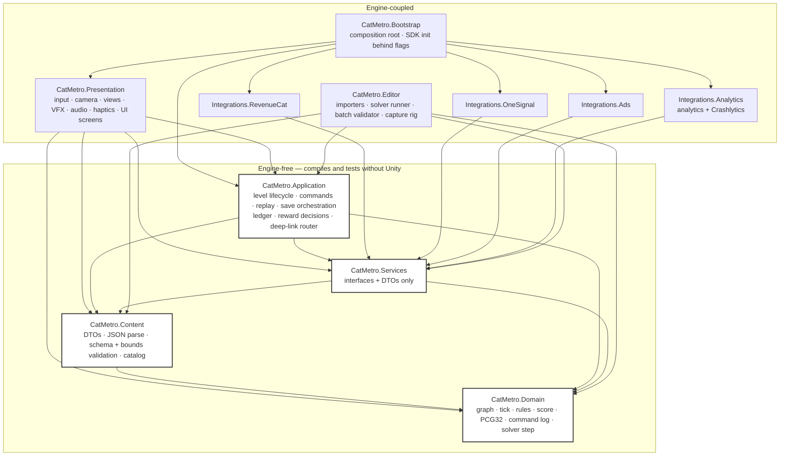
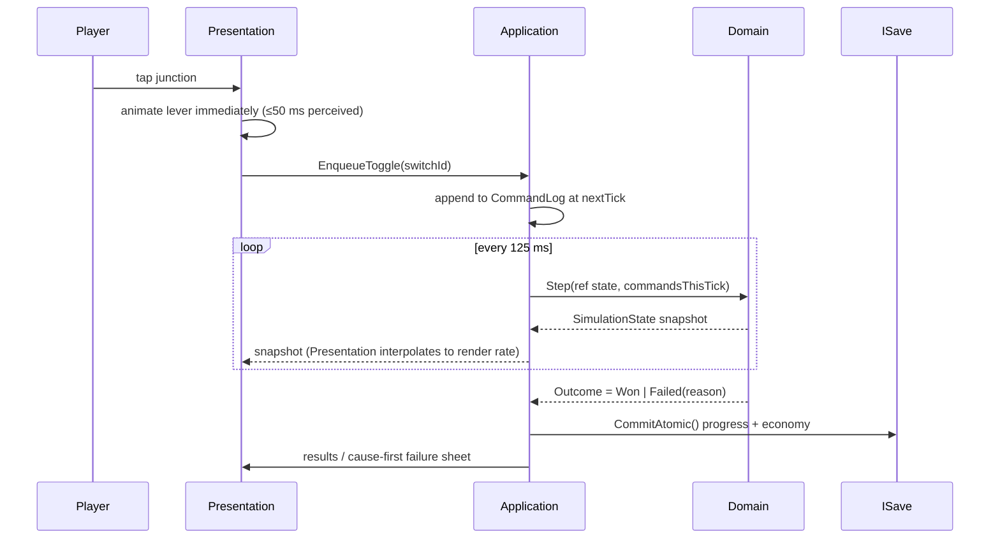
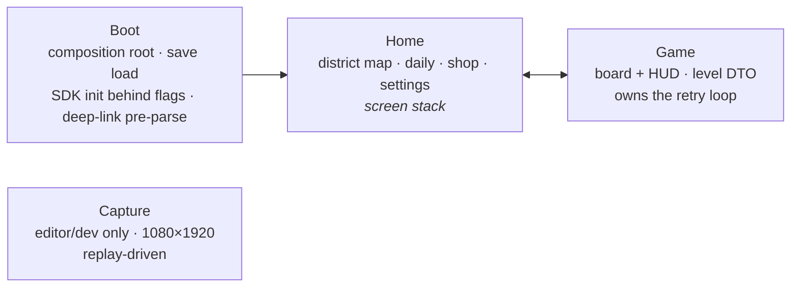
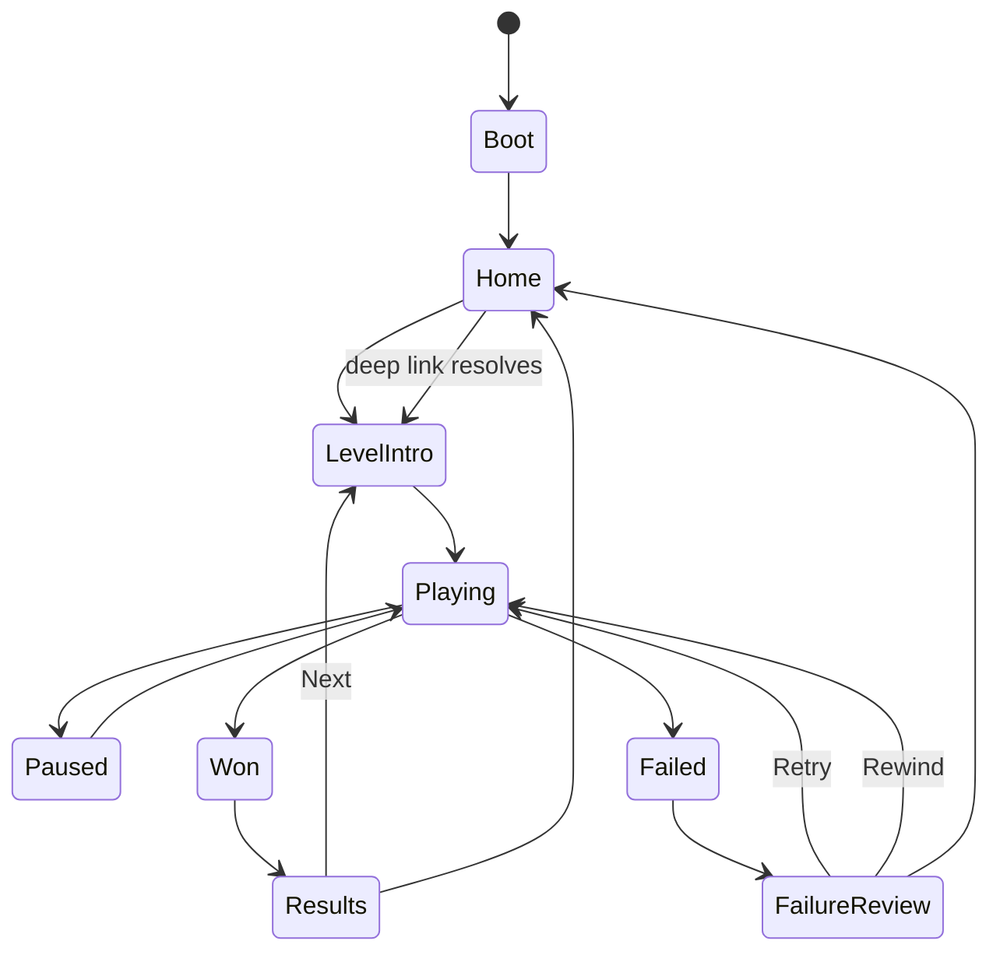

# Cat Metro — Architecture overview

**Status:** proposed, pending the ADR gate. Every section below links the ADR that owns it; nothing
here overrides an ADR. Ratified from `docs/plan/specs/architecture.md` (draft v1, 31 Jul 2026) on
2026-08-02.

**Sizing rule applied throughout** (`docs/constitution.md:8`): the smallest system that satisfies the
PRD. Every piece of machinery below is traceable to a named requirement; where the "proper" heavier
option was rejected, the rejection lives in an ADR with its real tradeoff.

**Read before proposing a change:** `docs/prd/PRD.md` · `docs/prd/risks.md` ·
`docs/plan/EXECUTION_PLAN.md` §Global constraints · this file · `docs/adr/`.

---

## 1. What this system is

A single-process Android game. No server, no accounts, no backend at 1.0
(`docs/prd/risks.md:145`). Three third parties are reached from the client — RevenueCat (commerce),
OneSignal (messaging), Google Mobile Ads + Firebase Crashlytics (ads, diagnostics) — each behind an
adapter, none on the critical path of play.

The product's core is a **deterministic pure-C# tick simulation** that five other things depend on:
the Daily Line (same board for everyone, no server), the solver that proves every level solvable
free, rewind, cause-first failure attribution, and the replay-driven capture rig. Everything else in
this document exists to keep that core clean.

| Concern | Answer | ADR |
|---|---|---|
| Simulation | pure C#, 8 tps / 125 ms, integer state, PCG32, command log, one `Step` | [0002](../adr/0002-deterministic-fixed-tick-domain.md) |
| Module boundaries | 13 assemblies (the 9 spec rows, `Integrations.*` expanded to four, plus `CatMetro.Bootstrap`), inward-only, SDKs visible to one assembly | [0003](../adr/0003-assembly-isolation-and-dependency-rule.md) |
| Versions | Unity 6000.3.16f1, minSdk 25/target 36, 7-row SDK pin table (incl. the dormant AppLovin fallback) + the `dotnet` toolchain rows, named unpin triggers | [0004](../adr/0004-toolchain-and-sdk-version-pins.md) |
| Tests | dotnet-first dual harness; same sources compiled by Unity later | [0005](../adr/0005-dotnet-first-dual-test-harness.md) |
| Persistence | header + JSON, atomic temp+rename, migration table, durable ledger, `[ARCH]` bounds | [0006](../adr/0006-save-format-purchase-ledger-and-runtime-bounds.md) |
| Runtime/UI | UGUI+TMP, screen stack, no Addressables, no remote config, flags as kill switch | [0007](../adr/0007-presentation-and-runtime-baseline.md) |
| Content | solver-validated JSON in StreamingAssets, immutable DTOs, schema v2, content hash | [0008](../adr/0008-content-pipeline-and-level-schema.md) |
| CI + credentials | credential-free required check; release behind a human-approved environment | [0009](../adr/0009-ci-topology-and-secret-custody.md) |

---

## 2. Component graph (assemblies)

Arrows point **inward only**. The four white assemblies contain **zero `UnityEngine` references** and
compile with the plain .NET SDK — that is what makes the fast, licence-free CI leg possible
([ADR-0005](../adr/0005-dotnet-first-dual-test-harness.md)).



**Diagram convention, stated so no one derives a stricter rule from it than the asmdefs encode:**
[ADR-0003](../adr/0003-assembly-isolation-and-dependency-rule.md)'s reference table is **normative**;
this diagram is a rendering of it and every edge the table grants is drawn — including the four that
an earlier revision omitted (`Services → Content`, `Presentation → Content`, `Presentation → Domain`
read-only types, `Editor → Services`). Where the two ever disagree, the table wins and the diagram is
the bug. `CatMetro.Editor`'s table row reads "all non-test", but **rule 1 is unconditional — only
`CatMetro.Bootstrap` may reference an `Integrations.*` assembly** — so no `Editor → Integrations.*`
edge exists and none may be added.

**The rule, stated once:** *only* `CatMetro.Bootstrap` may reference an `Integrations.*` assembly.
Violations are compile errors, not review findings. `CatMetro.Domain` references nothing at all — no
engine, no clock, no RNG but its own, no floating point
([ADR-0002](../adr/0002-deterministic-fixed-tick-domain.md) §3-5).

Test assemblies (`CatMetro.Tests.EditMode`, `CatMetro.Tests.PlayMode`) reference all non-test
assemblies and are omitted from the diagram for readability — that is 11 non-test nodes drawn here
plus 2 test asmdefs = the 13 assemblies of ADR-0003. `CatMetro.Tests.EditMode` holds **two source
folders inside one asmdef**: `EditMode/Pure/**` (engine-free, linked into the `dotnet` test project)
and `EditMode/Engine/**` (`UnityEngine`/`[UnityTest]` allowed, never linked) — the split that keeps an
ordinary EditMode test from breaking the credential-free required check
([ADR-0005](../adr/0005-dotnet-first-dual-test-harness.md)).

---

## 3. Data flow — one tick, one tap, one purchase



Three properties this diagram is asserting, each testable:

- **The lever animates on tap; the command applies on the tick boundary.** That decoupling is what
  buys ≤50 ms perceived latency (CM-R07.2) without touching determinism.
- **Presentation never simulates.** It receives snapshots and interpolates; it holds no authority.
- **The analytics event follows the durable write, never precedes it** (CM-R27.3) — the same rule for
  purchases, rewards and progress.

---

## 4. Scene map and game-state machine

Four scenes, and screen navigation is a **stack inside** Home and Game — not scene loads
([ADR-0007](../adr/0007-presentation-and-runtime-baseline.md)).





- **Purchase / restore / ad flows are modal overlays over any state.** The sim pauses; they are never
  a state of their own.
- **State survives process death** via the persisted screen-stack breadcrumb
  (`breadcrumbs.screenStack`, [ADR-0006](../adr/0006-save-format-purchase-ledger-and-runtime-bounds.md) §2).
- **The deep-link router runs *after* the save loads**, behind a crash-safe pre-parse in Boot
  (RK-27, `docs/prd/risks.md:104`).
- `Rewind` is not a separate state: it truncates the command log and re-enters `Playing` by
  re-simulating from tick 0 ([ADR-0002](../adr/0002-deterministic-fixed-tick-domain.md) §9).

---

## 5. Interface contracts — `CatMetro.Services`

Interfaces and DTOs only; **no SDK type appears in any signature**
([ADR-0003](../adr/0003-assembly-isolation-and-dependency-rule.md)). Six are ratified from
`docs/plan/specs/architecture.md:36`; `IContentSource`, `IDiagnostics` and `IStorageRoot` are
architect additions with named requirements (ADR-0003 §Decision) — **9 interfaces total.** Shapes
below are **ours**, not any SDK's — adapter implementations must be written against the pinned package
source and **no SDK API may be invented** (A-07, `docs/plan/EXECUTION_PLAN.md:480-481`).

**Who implements what** (so no implementer has to ask, and so the engine-free rule is checkable):

| Interface | Declared in | Implemented in | Why there |
|---|---|---|---|
| `ISave` | `Services` | **`CatMetro.Application`** (`SaveStore`) | it owns save orchestration and the ledger; stays engine-free via `IStorageRoot` |
| `IStorageRoot` | `Services` | **`CatMetro.Bootstrap`** | the **only** assembly that may name `UnityEngine.Application.persistentDataPath` |
| `IContentSource` | `Services` | **`CatMetro.Bootstrap`** | `StreamingAssets` reads need the engine on Android |
| `IClock` | `Services` | `CatMetro.Bootstrap` | wall clock is an engine/BCL edge; never reachable from `Domain` |
| `IPurchases`/`IAds`/`IMessaging`/`IAnalytics`/`IDiagnostics` | `Services` | the matching `Integrations.*` | rule 1: SDKs are visible to one assembly each |

```csharp
// Never referenced from CatMetro.Domain. Never read inside a tick.
public interface IClock {
    DateTimeOffset UtcNow { get; }
    DateTimeOffset LocalNow { get; }
    long           MonotonicMilliseconds { get; }   // rollback/jump detection, CM-R11.6
    string         LocalDateKey { get; }            // "yyyy-MM-dd", local midnight rollover
}

public interface ISave {
    SaveState  State { get; }                       // mutable in memory, durable only on commit
    LoadResult Load();                              // Ok | RecoveredFromBackup | Fresh | RefusedDowngrade
    void       CommitAtomic();                      // temp + Flush(flushToDisk:true) + File.Replace;
                                                    // throws only on unrecoverable IO. No directory
                                                    // fsync: unobtainable from managed code — the
                                                    // .bak fallback covers it (ADR-0006 §1)
    bool       TryCommitWithin(int budgetMs);       // OnApplicationPause path, SAVE_PAUSE_BUDGET_MS
    int        LastCommittedBytes { get; }          // asserted against SAVE_MAX_BYTES
}

public interface IStorageRoot {                     // write-side twin of IContentSource; the only
    string SaveDirectory  { get; }                  // seam that keeps CatMetro.Application engine-free
    string CacheDirectory { get; }                  // Bootstrap supplies persistentDataPath here
}

public interface IContentSource {                   // Android StreamingAssets is inside the APK
    Task<byte[]> ReadAsync(string relativePath, CancellationToken ct);
    bool         Exists(string relativePath);
}

public interface IAnalytics {                       // typed only; no raw event strings outside the adapter
    void Log(in AnalyticsEvent e);                  // enqueue → bounded offline queue → flush
    void SetUserProperty(UserPropertyKey key, string value);
    int  QueuedEventCount { get; }
}

public interface IDiagnostics {                     // one scrubber for crash keys + breadcrumbs (RK-31)
    void Breadcrumb(string scrubbedMessage);
    void SetKey(string key, string scrubbedValue);
    void RecordNonFatal(Exception ex, string domain);
}

public interface IPurchases {
    CustomerSnapshot Cached { get; }                             // entitlement cache, bound to AppUserId
    event Action<CustomerSnapshot> CustomerUpdated;              // includes revocation
    Task<OfferingView?>  GetOfferingForPlacementAsync(PlacementId placement, CancellationToken ct);
    Task<PurchaseResult> PurchaseAsync(ProductId product, CancellationToken ct);
    Task<CustomerSnapshot> RestoreAsync(CancellationToken ct);
    Task<CustomerSnapshot> RefreshAsync(CancellationToken ct);   // every online foreground
}

public interface IAds {
    bool IsAvailable { get; }                                    // false when ads_enabled == false
    Task<AdLoadResult> LoadRewardedAsync(AdPlacementId placement, CancellationToken ct);
    Task<AdShowResult> ShowRewardedAsync(AdPlacementId placement, CancellationToken ct);
}

public interface IMessaging {
    string SubscriptionId { get; }
    void   SetTag(TagKey key, string value);                     // declared tag set only (RK-30)
    Task<PushPermission> PromptAsync(CancellationToken ct);
    event Action<DeepLink> LinkOpened;                           // allowlisted routes only (RK-27)
}
```

**Contracts implementers can build against without asking:**

1. **Placement-first commerce.** Game code names a `PlacementId`, never an offering id. Zero `ofr_*`
   identifiers may exist outside `CatMetro.Integrations.RevenueCat` (CM-R25.1). Fallback policy:
   `post_level_5`/`bonus_district`/`shop` → current offering → cached last-good;
   `theme_preview`/`rewind_failure` → **nothing** (CM-R25.3).
2. **One entitlement check per feature.** No boolean algebra over entitlement ids in game code
   (CM-R24.1); the umbrella attach lives in the RC dashboard.
3. **Grants are ledger-only.** `ConsumableLedger.TryGrant(transactionId, productId)` is the sole
   function that may raise `rewindBalance` from a purchase; the durable write precedes the event
   (ADR-0006 §3).
4. **Caps are durable.** Ad and rewind daily caps live in the save's `caps`, never in
   `PlayerPrefs` or memory, and a no-fill fallback consumes the same cap slot as a completed watch
   (RK-24, `docs/prd/risks.md:94`).
5. **The deep-link router allowlists route *and* parameter names**, types and range-checks every
   parameter, never concatenates one into a path, runs after save load, and **no link may grant an
   entitlement/tickets/a rewind or open a purchase surface** (RK-27 — the human commissions this last
   one as a MUST).
6. **Every analytics event is a typed construction**; required params are constructor parameters, so
   an event missing one does not compile (CM-R43.3).
7. **Nothing throws on the boot path.** Save corrupt → `.bak` → fresh. Content parse failure →
   backup pool → Home. Missing flag → compile-time default. All logged, none fatal.

---

## 6. Data model sketch

Full field lists live in the owning ADRs; this is the shape and the invariants.

### `SimulationState` — integer only, no clock, no float ([ADR-0002](../adr/0002-deterministic-fixed-tick-domain.md))

```
SimulationState
  Tick:int  Score:int  Chain:int  Deliveries:int  Rejections:int  Overloads:int  SwitchesUsed:int
  Rng: Pcg32 { State:ulong  Inc:ulong }          // part of the state ⇒ part of the replay hash
  SwitchRoutes: byte[]                            // index = switchId
  NodeQueues:  short[][]                          // FIFO train ids per node
  OverloadTimers: short[]                         // per node; 16 ticks
  Trains: { Id:short  Color:byte  EdgeId:short  ProgressTicks:short  NodeId:short  State:byte }[]
  Outcome: Running | Won | Failed(FailReason)
  WriteDigest(Span<byte>)                         // canonical little-endian; layout is contract
```

`Step(ref SimulationState, ReadOnlySpan<Command>)` — the **only** step implementation; the solver,
the validator, the capture rig and the runtime all call it. Replay hash = incremental SHA-256 over
per-tick digests, 64 lowercase hex, compared byte-for-byte against
`tests/contract/replay-hash-golden.json` (human-authored).

### Commands

```
ToggleSwitchCommand { SwitchId:ushort  Tick:int }        // 8 bytes, append-only log
CommandLog          { Entries: ToggleSwitchCommand[] }   // (levelId, seed, commandLog) → identical outcome
```

### Level DTO — immutable, schema v2 ([ADR-0008](../adr/0008-content-pipeline-and-level-schema.md))

`sealed`, `readonly`, mirroring `docs/plan/data/level_schema.json` exactly:
`schemaVersion(=2) · id · name · seed · meta{band, difficultyTarget, mechanics, newMechanic,
teachingGoal, minActionWindowTicks, authoredBy, validatedAt?} · board{nodes, edges} · sources ·
stations · switches · gates? · waves · win{deliveries, timeLimitTicks, perfectMaxSwitches, stars{two,
three}} · economy? · tags?`. Bounds are re-checked at runtime, not only in CI. **Open: no `district`
field exists — see ADR-0008 §Open conflict.**

### Save payload ([ADR-0006](../adr/0006-save-format-purchase-ledger-and-runtime-bounds.md)) — **IRREVERSIBLE**

16-byte header (`"CMSV"` · formatVersion · saveVersion · payloadLength · CRC-32) + UTF-8 JSON:
`profile · progress · daily · economy · caps · ledger{keyScheme, dedupe[], audit[]} ·
entitlements{appUserId, active[], fetchedAtUtc} · flags · breadcrumbs · settings · contentHash`.
One atomic write (`Flush(flushToDisk:true)` on the temp file → `File.Replace`, which also produces
`save.dat.bak`). Dedupe key =
`hex16(SHA-256("cm-ledger-v1|" + productId + "|" + transactionId))`.

**The durable file inventory is closed and is exactly:** `save.dat` (+ `.bak`, + transient `.tmp`)
and **`analytics_queue.dat`** — metrics-only, same header/write helper, **non-transactional with
respect to the ledger by design** (a crash in the gap must lose the event, never the grant) and
excluded from auto-backup unconditionally (ADR-0006 §5). `caps.counters` carries exactly the five
locked ad surfaces; `flags` exactly the six ADR-0007 keys; `breadcrumbs.purchase` is
`{productId, placement, startedAtUtc, state}` or `null`.

### `[ARCH]` constants — single source `config/runtime_bounds.json`

`SAVE_MAX_BYTES 524288` · `SAVE_PAUSE_BUDGET_MS 50` · `LEDGER_DEDUPE_MAX_ENTRIES 5000` ·
`LEDGER_AUDIT_MAX_ENTRIES 200` · `QUEUE_MAX_EVENTS 2000` · `QUEUE_MAX_BYTES 1048576` ·
`QUEUE_EVENT_MAX_BYTES 512` · `QUEUE_FLUSH_HIGH_WATER 64` ·
`QUEUE_FLUSH_TRIGGER ["network_reachable","app_foreground","app_pause","high_water"]` ·
`ATTRIBUTION_MAX_RESIMS 24` · `CONTENT_MAX_FILE_BYTES 262144` · `CONTENT_MAX_JSON_DEPTH 16`.
Rationales in ADR-0006 §4. **The event cap binds; the byte cap is a backstop** sized at
≥ `QUEUE_MAX_EVENTS × QUEUE_EVENT_MAX_BYTES` so CM-R43.4(a) — which runs *at* `QUEUE_MAX_EVENTS`
(`docs/prd/PRD.md:688`) — cannot drop events against its own bound.
Economy constants (`DELIVERY_POINTS`, …) are **human** decisions and live separately in
`config/economy_defaults.json` (CM-R04.1).

---

## 7. Repository layout this architecture implies

```
unity/                       Unity project root (6000.3.16f1)
  Assets/Scripts/{Domain,Content,Services,Application,Presentation,Integrations.*,Bootstrap}/
  Assets/Tests/EditMode/Pure/     engine-free; LINKED into the dotnet test project (ADR-0005)
  Assets/Tests/EditMode/Engine/   may use UnityEngine/[UnityTest]; NEVER linked
  Assets/Tests/PlayMode/
  Assets/StreamingAssets/content/{levels,daily_overrides.json,daily_backup_pool.json,catalog.json,content.sha256}
  Assets/StreamingAssets/config/runtime_bounds.json   byte copy of config/runtime_bounds.json (ADR-0008)
dotnet/                      csproj mirrors of the four engine-free assemblies + one NUnit test project
  packages.lock.json         committed; exact NuGet versions (ADR-0004 pin hygiene, third pin location)
content/                     authored level JSON (source of truth) + generator inputs
config/                      runtime_bounds.json (ARCH) · economy_defaults.json (human) · pins.json
tests/                       *.test.sh wrappers · tests/contract/ (immutable goldens)
scripts/                     check.sh · test.sh · build.sh (existing harness, interface unchanged)
docs/                        constitution · adr/ · architecture/ · prd/ · perf/ · security/ · runbooks/
```

Two things about this tree are assertions, not description:

- **`unity/Assets/StreamingAssets/config/runtime_bounds.json` is a build artifact**, copied verbatim
  by `CatMetro.Editor`'s `ContentSync` step from the authored `config/runtime_bounds.json`. It is
  **not** indexed in `catalog.json` and therefore **not** folded into `content.sha256` — bounds are
  not content, and an `[ARCH]` tweak must not read as a corpus change on installed devices
  ([ADR-0008](../adr/0008-content-pipeline-and-level-schema.md)). The required `ci` check asserts the
  two files are byte-identical.
- **Ratifying [ADR-0004](../adr/0004-toolchain-and-sdk-version-pins.md)/[0005](../adr/0005-dotnet-first-dual-test-harness.md)
  obliges a matching `AGENTS.md` edit** in the same change-set: the `Stack: TBD — deferred until the
  product specs land` line becomes Unity 6000.3.16f1 / C# / IL2CPP / .NET Standard 2.1 / minSdk 25 ·
  targetSdk 36, and the Commands section records that `scripts/check.sh` and `scripts/test.sh` now
  route to the `dotnet` leg (the `tests/**/*.test.sh` harness *interface* is unchanged). `AGENTS.md`
  is outside the architect's write boundary, so this is a **ratification action for the human**; until
  it lands, the repo's instruction file contradicts the ADR set.

---

## 8. Top technical risks (architecture-owned) and the spike

Full register: `docs/prd/risks.md` (39 rows). These are the ones this architecture is betting on, with
likelihood × impact as an architecture judgement:

| # | Risk | L | I | Owner / mitigation |
|---|---|---|---|---|
| **A-1** | **EDM4U dependency conflict across RevenueCat + OneSignal + GMA + Firebase makes an Android build impossible or non-reproducible.** It is the first thing that can stop the project dead, it is on the Day 1-3 path, and no dependency tree has been checked (RK-36) | **High** | **High** | Spike below. One EDM4U 1.2.188, resolved file committed and diffed (ADR-0004) |
| A-2 | Replay hash differs between the x64 CI host and ARM64 device, making CM-R01.1 unenforceable | Low | High | Integer-only state removes the mechanism (ADR-0002); the cross-tier check is a release gate |
| A-3 | Cause-first attribution exceeds its budget on the low tier (re-simulations of ≤4000 ticks; naive ceiling `C_max = switches × 24 = 240`) | Medium | Medium | Hard-capped at `ATTRIBUTION_MAX_RESIMS 24`, newest-first, cap ⇒ the already-legal "camera on node, zero blame chips" render (ADR-0002 §9, ADR-0006 §4); measure wall time at the vertical slice |
| A-4 | 16 KB page-size violation in a shipped `.so` blocks the store submission late | Medium | High | Audit every `.so` at import, not at launch; 16 KB emulator in the matrix (ADR-0004) |
| A-5 | Save/backup conflict (RK-17 vs CM-R27.4) shipped unresolved → free-consumable path or lost progress | Medium | Medium | **Blocked on a human decision**, ADR-0006 §Open conflict; must land *with* the save format |
| A-6 | Content/sim schema drift silently invalidates authored levels | Medium | High | `validatedAt` staleness gate + content hash in save (ADR-0008) |
| A-7 | Solo-posture CI: a self-merged workflow change reaches release credentials | Medium | Critical | Blast-radius reduction (ADR-0009); residual accepted and recorded in ADR-0001 |

### Spike proposal for A-1 — throwaway, time-boxed, in a worktree

- **Question (one, falsifiable):** can Unity 6000.3.16f1 + purchases-unity 9.7.0 + OneSignal 5.3.2 +
  GMA 11.3.0 + Firebase Crashlytics resolve through a **single** EDM4U 1.2.188 and produce a
  **signed-debug AAB that installs and launches on a device**, with **exactly one `BillingClient`**
  in the merged manifest and **zero 16 KB page-size violations** in the `.so` set?
- **Where:** `git worktree add ../spike-edm4u spike/edm4u` — a throwaway branch in a throwaway
  worktree. **Nothing from it merges.** No product code, no ADR change, no schema.
- **Time box:** one working day. At the box, stop and report regardless of state.
- **Deliverable:** a written result in `docs/plan/` or the session report — the resolved-dependencies
  file, the merged-manifest `BillingClient` count, the `.so` page-size table, and either "green" or
  the exact conflict. If Crashlytics is the conflicting party, ADR-0004 names it as the most
  reversible pin in the table and the answer is Unity Cloud Diagnostics; if the conflict is GMA, the
  AppLovin 8.6.4 fallback moves from dormant to a live decision.
- **Why a spike and not a task:** the answer changes an ADR (0004), and the work is throwaway import
  wrangling with no tests worth keeping. Building it as a contract would produce a diff nobody wants
  to review and a green gate that proves nothing.

---

## 9. Open items an implementer will hit (and must not resolve alone)

These are already-open PRD pins or ADR-flagged escalations — they are listed here so a task does not
stall silently.

| Item | Blocks | Where |
|---|---|---|
| **NEW-Q4** rejected cat meets oncoming cat on a one-way edge | one tick-order branch | ADR-0002; `docs/prd/PRD.md:114-118` |
| **NEW-Q35** wildcard resolution boundary | tick order **and the command-log format** | ADR-0002; `docs/prd/PRD.md:121` |
| **NEW-Q5** chain counter saturation | scoring + purr-meter state | `docs/prd/PRD.md:150` |
| **NEW-Q7** per-level ticket schedule | `economy.*` values, not level authoring | ADR-0008; `docs/prd/PRD.md:232` |
| **NEW-Q1** flat 45-90 s vs per-band ranges | validator input | `docs/prd/PRD.md:228-231` |
| **NEW-Q19** offline queue bounds | **RESOLVED here** — ADR-0006 §4 sets them | ADR-0006 |
| **NEW-Q45** ads consent (CMP/UMP vs restricted availability vs `ads_enabled=false`) | every ad surface | ADR-0007; `docs/prd/PRD.md:38` |
| **NEW-Q48 / RK-33** credential custody acceptance **+ the recorded `android-smoke` deviation from CM-R52.6** (`docs/prd/PRD.md:830`) | the first `.github/**` PR | ADR-0009 §Conflict |
| **Open sub-shapes inside the IRREVERSIBLE save payload**: `caps.sessionCounters` (the 2/session half of `rewind_failure`), `flags.paywall_placements` type, `breadcrumbs.purchase.state` enum (blocked on RK-39 — read the RC 9.7.0 source, never invent) | the save format merge | ADR-0006 §2 |
| **RK-17** auto-backup vs one-atomic-write | the save format merge | ADR-0006 §Open conflict |
| **A-19** no `district` field in schema v2 | level authoring order | ADR-0008 §Open conflict |
| **RK-39** RC 9.7.0 API surface unverified | ledger + entitlement code | ADR-0004; read the package source first |

**Numbering note:** `docs/plan/EXECUTION_PLAN.md:140` refers to "ADR-0007" in the plan's own gate-ADR
scheme (`data/github_issue_backlog.md` format, `docs/plan/EXECUTION_PLAN.md:487`). That is **not**
`docs/adr/0007-*`. The two schemes collide by accident; gate ADRs should be renumbered or renamed
before the D7 gate produces one.
