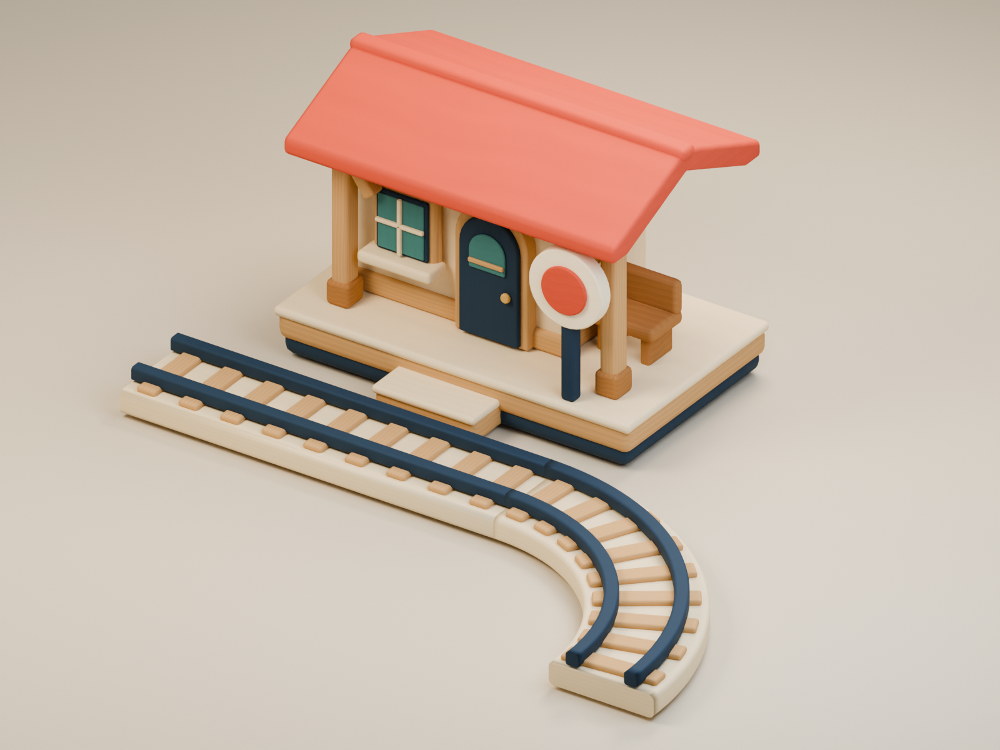

# Original station and track prototype

A cream toy station with a tomato roof, navy arched door, sheltered wooden bench,
and ivory/red circle marker. The straight and quarter-circle track use cream wood,
rounded sleepers, and soft navy rails. All geometry and the analytic wood/paint
texture are authored by the generator; no imported models, image textures, fonts,
or provider services are used. `PROVENANCE.json` records each asset and its hashes.



From the repository root, using Blender **5.1.2 / ec6e62d40fa9**:

```sh
blender --background --factory-startup --threads 6 --python-exit-code 97 \
  --python scripts/blender_original_station_track.py -- \
  --output-dir docs/design/assets/original-station-track
blender --background --factory-startup --threads 6 --python-exit-code 97 \
  --python scripts/verify_original_station_track.py -- \
  --asset-dir docs/design/assets/original-station-track
```

`Source/original-station-track.blend` is the editable source with packed texture
and the preview scene. `Models/` contains separate FBX and GLB exports; `Textures/`
contains their shared atlas. Preview-only camera, lights, and floor are excluded
from exports. The saved Blender scene arranges the meshes for viewing; reset an
asset object's location/rotation before manual re-export, or rerun the generator.

| Asset | Triangles | Authoring vertices | Materials | Size, Blender X/Y/Z |
|---|---:|---:|---:|---|
| Station | 8,476 | 4,312 | 1 | 3.05 × 2.17 × 2.222 |
| Straight track | 1,872 | 960 | 1 | 0.90 × 3.20 × 0.315 |
| Quarter-circle track | 5,616 | 2,832 | 1 | 2.35 × 2.35 × 0.315 |

Each asset is one mesh with one shared matte material, using a single 1024×512
RGB atlas (2 MiB if uploaded as RGBA8, before mipmaps). Bevels are applied; the
authoring solids have zero non-manifold edges. UV/normal seams split vertices in
interchange exports. Pieces are assembled closed solids, not a boolean-unioned
solid or collision mesh.

Coordinates are Blender Z-up, with ground at Z=0. Station front is -Y; its origin
is the centre of the platform at ground height. Track origins are at the start
centreline at ground height; straight points +Y. The curve starts +Y and turns
90° toward +X with radius 1.9. Rails have 0.5 centre gauge, 0.11 width, and crown
height 0.315. The bed is 0.9 wide. Export roots are identity; FBX uses Y-up,
`axis_forward='-Z'`, `bake_space_transform=True` per this repository's convention.
Blender's FBX reimport adds its normal 90° coordinate-conversion rotation.

All six FBX/GLB imports preserve triangle counts, bounds within 0.00005 units,
and base-colour texture binding. Every FBX embeds the exact atlas PNG bytes.
`EXPORT-VERIFICATION.json` records the actual imports; preview 06 renders those
FBX imports. A second fresh generation into a separate directory produced
identical geometry metrics, atlas bytes, and GLB bytes (`REPRODUCTION.json`).
FBX and `.blend` container bytes can vary with path/time metadata.

Opened previews: 01 assembled overview, 02 front, 03 rear, 04 station at 192×164,
05 separate tracks, and 06 reimported FBXs. These are Blender studio previews.
Unity import, URP binding, runtime catalog admission, authored-level placement,
train clearance, Android rendering, and frame time have **not** been verified.
The existing runtime track builder still owns arbitrary graph curves; these
two pieces are a visual prototype, with no runtime integration in this change.
