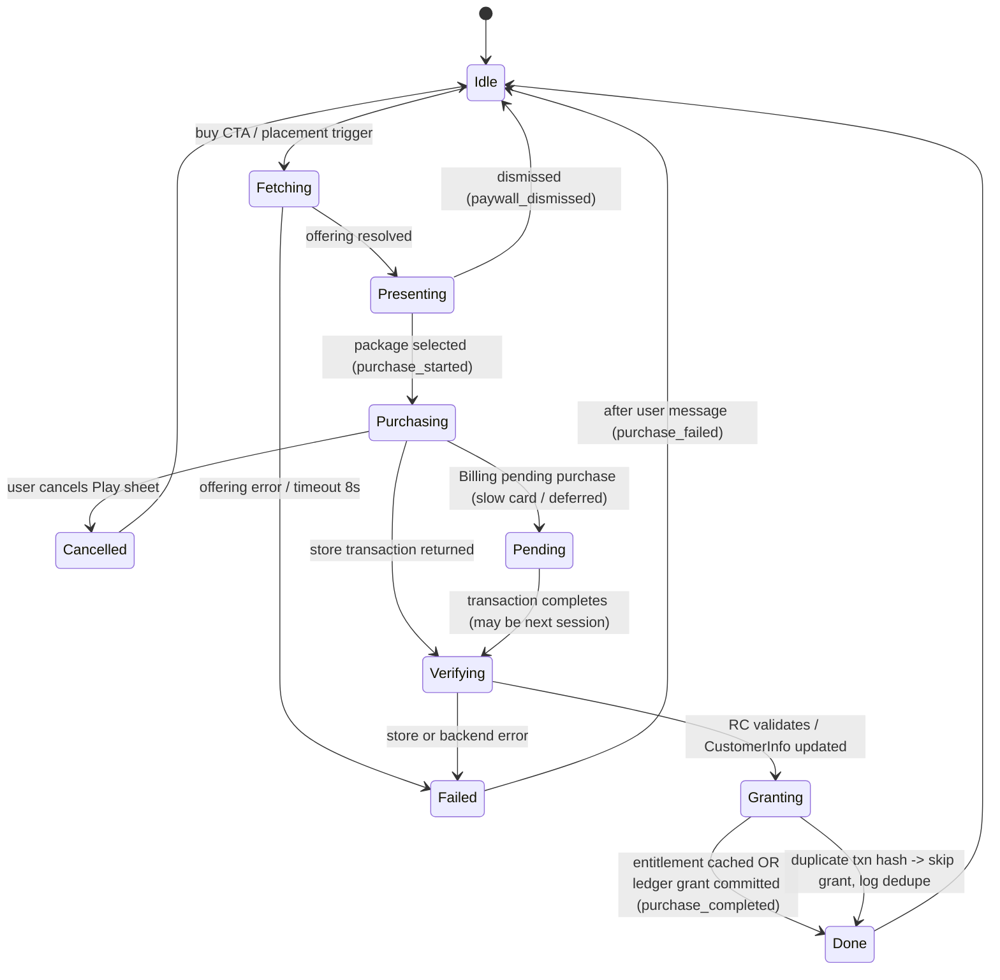

# RevenueCat Implementation Spec — Cat Metro (Unity / Android)

Status: v1, 31 Jul 2026. Companion to `specs/architecture.md` (assembly layout, lifecycle
rules, save system) and `data/analytics_event_taxonomy.csv` (all event names used here).
All version pins and platform facts below are from DECISIONS_BRIEF.md, verified 2026-07-31.

Scope: everything between "player taps a price" and "entitlement is durably granted",
plus the dashboard work that must happen Day 1 (Aug 1) so the Aug 24–28 public 1.0 and
the Shipaton submission window (Jul 31 – Sep 30 2026, verified 2026-07-31) are never
blocked on store plumbing.

---

## 1. Pinned versions + compatibility matrix

One copy of everything. No Unity IAP. No second EDM4U.

| Component | Pinned version | Source of pin | Notes |
|---|---|---|---|
| Unity | **6000.3.16f1** | brief (verified 2026-07-31) | Ships Gradle 8.13 / AGP 8.10.0. **Do NOT move to 6000.3.17f1+** (Gradle 9 / AGP 9.0) until GMA, RevenueCat, and OneSignal each confirm AGP 9 compatibility. Unity 6.3 LTS supported to Dec 2027. |
| purchases-unity (RevenueCat) | **9.7.0** | brief (latest as of 2026-07-31) | Bundles **Google Play Billing 8.3.0** → compliant with Play's Billing 8+ requirement effective Aug 31 2026 (verified 2026-07-31). Includes Placements, Test Store (8.3.0+), AdTracker (9.1.0+), Virtual Currency (8.1.0+, unused at launch). |
| purchases-ui-unity (RevenueCatUI) | **paired with 9.7.0** | brief | Paywalls v2 + Customer Center. Device-only (no Editor rendering). 3 open Android paywall crash issues (#745/#736/#732) → device-test heavily; custom fallback mandatory (Section 8c). |
| OneSignal Unity | **5.3.2** | brief | Still uses Google EDM4U. Needs custom Gradle templates (`mainTemplate.gradle`, `gradleTemplate.properties` under version control) + Force Resolve. |
| Google Mobile Ads Unity (AdMob) | **11.3.0** | brief | Ad serving SDK; RevenueCat Ads (beta) is a tracking layer on top — it does NOT serve ads. AdMob convenience module is NOT available for Unity → manual AdTracker calls (Section 3). Fallback network: AppLovin MAX 8.6.4 (not installed unless AdMob fails spike). |
| External Dependency Manager (EDM4U) | **1.2.188** | brief | **Exactly ONE copy in the project.** GMA and OneSignal installers both try to bundle their own — delete duplicates, keep the standalone 1.2.188. CI runs Force Resolve and diffs the resolved-dependencies file on every SDK-touching PR. |
| Android minSdk / targetSdk | **25 / 36** | brief | Target API 36 required for new apps from Aug 31 2026 (ext. Nov 1). 16 KB page size mandatory (API 35+ since Nov 2025): RevenueCat/Billing are Java-only (safe); audit GMA + Unity native `.so` files on the 16 KB emulator image. |
| Scripting | IL2CPP, ARM64 only | architecture.md | Play requirement. |

Known integration landmines (all verified 2026-07-31, all covered in Week-1 device spike):

- **Duplicate BillingClient**: happens when Unity IAP coexists with purchases-unity. We do not install Unity IAP, ever. If a transitive Billing duplicate appears in the resolved deps diff, exclude via Gradle.
- **Stale local AndroidX AARs**: after any SDK upgrade, delete `Assets/Plugins/Android` resolved artifacts and re-run Force Resolve; commit the diff.
- **OneSignal Gradle templates**: enable Custom Main Gradle Template + Custom Gradle Properties Template before first OneSignal build; keep both under version control (architecture.md risk zone 2).
- **ProGuard/R8**: keep-rules for Billing, GMA, OneSignal push receivers; test the minified release build in Week 2, not launch week.

- **Decision**: Freeze the entire commercial SDK stack at the versions above until after the Sep 30 submission freeze; upgrades only for a security/policy-blocking issue, and only after re-running the device smoke suite.
- **Evidence**: Brief-verified pins (2026-07-31); Play Billing 8+ and target API 36 deadlines land Aug 31 2026 — mid-window; AGP 9 breakage risk on 6000.3.17f1+ is documented in the brief.
- **Action (P0)**: Aug 1 — create the Unity 6000.3.16f1 project, install the five packages above in order (EDM4U → purchases-unity → purchases-ui → GMA → OneSignal), commit the resolved-dependencies file, and run the first on-device build.
- **Risk**: A forced mid-window SDK patch (e.g., Play policy hotfix) breaks the EDM4U graph during launch week.
- **Fallback**: Version-pinned branch of `Assets/Plugins/Android` + resolved-deps file in git means any upgrade is one `git revert` away; feature flags (`ads_enabled`, `paywall_placements`) let us ship with a broken subsystem dark.

---

## 2. RevenueCat dashboard setup checklist — Day 1 (Aug 1), in execution order

Order matters: Play won't let you create in-app products until an AAB with the
`com.android.vending.BILLING` permission is uploaded, and Play service credentials can
take up to ~36 h to propagate — so the credential and upload steps front-run everything.

| # | Step | Detail | Priority |
|---|---|---|---|
| 1 | Create RC project | Project name **Cat Metro**. Note: check project plan tier here — Experiments and Targeting are Pro/Enterprise-gated (verified 2026-07-31); if not Pro, the A/B plan for $4.99 vs $6.99 becomes sequential offering changes + Placements. | P0 |
| 2 | Add Android app to project | Package name **com.catmetro.game** (catmetro.io verified unregistered via RDAP 2026-07-31 — register the domain the same day; package name is immutable after first Play upload). Copy the public Android SDK key (`goog_…`) into the build config. | P0 |
| 3 | Play Console app + first upload | Create the Play app (13+ target audience per brief Families decision), enable Play App Signing, upload the Day-1 skeleton AAB (with Billing permission, targetSdk 36) to the **closed test track** and recruit the 12 testers — this also starts the mandatory 14-day closed-test clock (personal account path, verified 2026-07-31). | P0 |
| 4 | Play service account JSON → RC | Google Cloud project → enable Google Play Android Developer API → create service account → JSON key. In Play Console *Users & permissions*, invite the service account with **View app information**, **View financial data**, **Manage orders** (financial + orders are required for RC to validate purchases and see refunds). Upload JSON in RC app settings. Expect up to 36 h validation lag — this is why it is step 4 of Day 1, not Day 5. | P0 |
| 5 | Create the 6 Play in-app products | `cm_all_access` $6.99 · `cm_supporter_pack` $9.99 · `cm_theme_sakura` $2.99 · `cm_theme_neon` $2.99 · `cm_rewind_5` $1.99 · `cm_rewind_20` $4.99. All "Managed product" type (consumption is client-driven via Billing 8; RC consumes rewinds automatically after our server-less grant). Activate all six. | P0 |
| 6 | Import products into RC | RC → Products → import from Play (or add the six IDs manually if propagation lags). | P0 |
| 7 | Entitlements | `all_access` ← cm_all_access, cm_supporter_pack. `supporter` ← cm_supporter_pack. `theme_sakura` ← cm_theme_sakura, cm_all_access, cm_supporter_pack. `theme_neon` ← cm_theme_neon, cm_all_access, cm_supporter_pack. (Attaching the umbrella products to the theme entitlements means client code only ever checks one entitlement ID per feature — no boolean algebra in game code.) Rewinds are consumables: **no entitlement**; fulfillment is our ledger (Section 8a). | P0 |
| 8 | Offerings | `ofr_core` (packages `all_access`, `supporter`) — set as **current**. `ofr_themes` (`theme_sakura`, `theme_neon`, `all_access` upsell). `ofr_rewind` (`rewind_5`, `rewind_20`, `all_access` upsell — All Access includes daily free rewind). `ofr_shop` (all six). Custom package identifiers throughout; no `$rc_` magic packages needed for one-time products. | P0 |
| 9 | Placements | Exactly the five from the brief: `post_level_5`→ofr_core, `theme_preview`→ofr_themes, `bonus_district`→ofr_core, `shop`→ofr_shop, `rewind_failure`→ofr_rewind. Placements are supported in purchases-unity ≥6.9.0 (verified 2026-07-31); 9.7.0 is fine. | P0 |
| 10 | Paywall v2 build | Dashboard paywall editor: build the `post_level_5` celebratory paywall on `ofr_core` (copy per monetization spec: "Fair by design" framing, All Access hero, Supporter secondary, close button always visible ≥48 dp). All other placements use custom UGUI (brief decision). | P0 |
| 11 | RevenueCat Ads beta request | Dashboard → Ads page → request access (public beta, verified 2026-07-31). Submit Day 1 — beta approval latency is outside our control and Catvertising judging requires describing RevenueCat Ads use. | P0 |
| 12 | Webhooks | Add a webhook endpoint (Cloudflare Worker, ~50 LOC, append-only log to KV + daily email digest) for `INITIAL_PURCHASE`, `NON_RENEWING_PURCHASE`, `CANCELLATION`, `EXPIRATION`, `BILLING_ISSUE`. Purpose: independent audit trail for consumable fulfillment disputes and refund detection (brief: webhooks recommended for consumables). Not in the purchase path — the game never blocks on it. | P1 |
| 13 | Test Store | Create the RC Test Store app in the same project; wire its API key into dev builds behind `#if CM_TEST_STORE`. Lets us exercise purchase/restore/paywall flows before Play credentials propagate and before the closed track is live (Test Store supported ≥8.3.0, verified 2026-07-31). | P0 |
| 14 | OneSignal integration | RC dashboard → Integrations → OneSignal (App ID + REST key). Client sets the `$onesignalUserId` attribute after OneSignal init (brief-verified pattern); RC then writes purchase tags to OneSignal for the lapse-ladder and shop journeys. | P0 |
| 15 | Promo codes for judges | Play Console → Promo codes: generate one-time codes for `cm_all_access` (Play one-time codes verified working for one-time in-app products, 2026-07-31 — this solves judge access). Quota is limited per quarter (500 at last check — reverify in Console); generate 25 for judges + press, hold the rest. Do this once products are active (post step 5); listed here so it's on the Day-1 sheet. | P0 |

- **Decision**: All dashboard work is Day-1 work; nothing in this checklist waits for game code.
- **Evidence**: Play credential propagation (~36 h) and the 14-day closed-test clock (verified 2026-07-31) are both wall-clock serial dependencies on the Aug 24–28 launch; RC Ads beta approval latency is unbounded.
- **Action (P0)**: Execute steps 1–11 + 13–14 on Aug 1; step 12 by Aug 3; step 15 as soon as products activate.
- **Risk**: Play service-account validation fails silently (wrong permission set is the classic cause) and purchases can't validate during the closed test.
- **Fallback**: Test Store covers all client-side flow testing meanwhile; re-issue the JSON key with the three permissions listed and allow another 36 h — schedule slack exists because this is Day 1, not Day 20.

---

## 3. Unity service wrapper architecture

Per architecture.md: `CatMetro.Services` holds interfaces only; `CatMetro.Integrations.RevenueCat`
is the single asmdef that references the RC packages; nothing else may `using RevenueCat`.
The composition root (Boot scene) binds `RevenueCatPurchasesAdapter` on device and
`FakePurchases` in Editor/EditMode tests.

### IPurchases surface (CatMetro.Services)

```csharp
public interface IPurchases
{
    // Boot-time. Idempotent. Never throws; failure lands in the result.
    Task<PurchasesInitResult> InitAsync(PurchasesRuntimeConfig config);

    // Placement-first: game code asks by placement id, never by offering id.
    Task<OfferingSnapshot?> GetOfferingForPlacementAsync(string placementId);

    // One purchase in flight at a time; adapter enforces (second call → Busy result).
    Task<PurchaseFlowResult> PurchaseAsync(PackageRef package, string placementId);

    Task<RestoreResult> RestoreAsync();

    // Last known CustomerInfo projection, served from EntitlementCache (Section 8b) —
    // valid offline, valid before Init completes (from disk). Never null after boot.
    CustomerSnapshot Customer { get; }
    event Action<CustomerSnapshot> CustomerChanged;   // always raised on main thread

    // RCUI. Returns outcome (Purchased/Restored/Dismissed/Error/FellBack).
    Task<PaywallOutcome> PresentPaywallAsync(string placementId);
    Task PresentCustomerCenterAsync();                // P1: settings screen entry

    IAdTracker AdTracker { get; }                     // pass-through, no-op until RC Ads beta approved
}

public interface IAdTracker   // maps 1:1 to RC AdTracker (purchases-unity ≥9.1.0, verified 2026-07-31)
{
    void TrackAdLoaded(AdContext ctx);
    void TrackAdDisplayed(AdContext ctx);
    void TrackAdOpened(AdContext ctx);
    void TrackAdRevenue(AdContext ctx, double revenueMicros, string currency);
    void TrackAdFailedToLoad(AdContext ctx, int errorCode);
}
```

`AdContext` = `{ placement, network, adUnitId }` with placement ∈ the five rewarded
placements from the brief (`rewind_failure`, `double_tickets`, `daily_gift_double`,
`streak_saver`, `theme_rental`). The AdMob adapter calls IAdTracker on every ad
lifecycle event; server-verified ad rewards are **not available on Unity** (verified
2026-07-31), so reward grants are client-side against our own ledger — same
grant-once discipline as purchases.

### Adapter rules (CatMetro.Integrations.RevenueCat)

1. **Main-thread marshaling (P0)**: RC Unity callbacks can arrive off the main thread.
   The Boot scene captures `SynchronizationContext.Current` into a static
   `MainThread.Post(Action)` helper; the adapter wraps **every** SDK callback in
   `MainThread.Post` before touching any result, cache, or event. Dev builds assert
   `MainThread.IsMainThread` at every IPurchases event emission — a violated assert
   is a build-blocking bug, not a warning.
2. **Single-flight purchases**: a `_purchaseInFlight` guard rejects concurrent
   `PurchaseAsync` calls with `PurchaseFlowResult.Busy`. UI disables all buy CTAs
   while any modal commercial flow (purchase, restore, ad) is open (architecture.md).
3. **Anonymous app user ID**: no RC `LogIn` — Cat Metro has no accounts. OneSignal
   linkage is via the `$onesignalUserId` subscriber attribute only.
4. **Init behind feature flag**: Boot initializes RC even when `paywall_placements`
   is dark (commercial beta ships systems dark per architecture.md); the flag gates
   presentation, not initialization, so CustomerInfo/restore still work.
5. **Analytics choke point**: the adapter emits exactly the taxonomy events —
   `purchase_started`, `purchase_completed` (with `txn_id_hash`), `purchase_failed`,
   `restore_started`, `restore_completed`, `entitlement_changed`, `paywall_viewed`,
   `paywall_dismissed` — via `IAnalytics`. No other layer logs purchase events.
6. **FakePurchases** (Editor/tests): scriptable scenario table — instant success,
   user-cancel, pending→success after 10 s, duplicate callback, error(class) —
   drives the PlayMode purchase-mock suite in architecture.md.

- **Decision**: Placement-first, cache-backed, main-thread-guaranteed wrapper; game code never sees an RC type.
- **Evidence**: Architecture.md dependency rule (Integrations referenced only by composition root); RC callbacks' threading behavior; offline-first product decision requires `Customer` to be answerable from disk.
- **Action (P0)**: Implement `IPurchases` + adapter + FakePurchases in Week 1; PlayMode mock-flow tests green by D7 (Aug 7) SDK spike gate.
- **Risk**: A missed `MainThread.Post` on a rare callback path (e.g., deferred-purchase completion) corrupts UI state intermittently and only on device.
- **Fallback**: The dev-build main-thread assert plus process-death smoke (adb kill during purchase) catch it in the D14 device suite; worst case the affected placement is disabled via `paywall_placements` flag while shop remains custom-UI.

---

## 4. Purchase + restore state machine



Restore runs the same spine without Presenting: `Idle → Fetching(CustomerInfo) →
Verifying → Granting → Done`, emitting `restore_started`/`restore_completed`.

**State rules**

- Only **Granting → Done** mutates durable game state, and it does so inside one
  atomic save write (temp+rename, per architecture.md): entitlement cache snapshot
  and/or consumable ledger entry + rewind balance land together or not at all.
- **Pending** is a first-class state, not an error: UI shows "Waiting for Google Play
  to confirm — your rewinds arrive automatically." The app returns to gameplay;
  completion arrives via the CustomerInfo listener, possibly in a later session.
- Sim is paused and back-gesture is swallowed from Purchasing onward (architecture.md
  lifecycle rules); a purchase modal can never be interrupted into a corrupt screen stack.

**Process-death recovery (P0)**

A durable breadcrumb `purchase_breadcrumb {placementId, productId, state, startedAtUtc}`
is written when entering Purchasing and cleared at Done/Cancelled/Failed. On boot:

1. Breadcrumb present → enter **Verifying** silently: fetch CustomerInfo (or serve
   cache if offline and queue the fetch).
2. Non-consumables: entitlement now active → run Granting (idempotent — cache diff
   emits `entitlement_changed(granted)` once). Not active → leave breadcrumb for one
   more session, then expire it at 72 h with a `purchase_failed(error_domain=recovery,
   error_code=breadcrumb_expired)` log; Play's own out-of-app refund path protects the
   user if money actually moved.
3. Consumables: RC redelivers unconsumed transactions on next sync; the **ledger
   grant-once check (hashed transaction id, Section 8a)** makes redelivery and
   duplicate callbacks harmless — grant happens exactly once per transaction id
   regardless of how many times the callback replays.

- **Decision**: Grant only at one choke point, atomically, keyed by hashed transaction id; treat Pending and process death as normal paths with breadcrumb-driven reconciliation.
- **Evidence**: Architecture.md mandates never granting from memory on resume; Billing pending purchases are guaranteed to occur under license-tester "slow card" testing; consumable fulfillment ledger is ours by design (brief, verified 2026-07-31).
- **Action (P0)**: Implement breadcrumb + recovery in the same PR as the adapter; add `adb shell am kill` during-purchase to the smoke suite (architecture.md already lists it).
- **Risk**: A transaction whose Play charge succeeded but whose RC validation is unreachable for >72 h (breadcrumb expiry) strands a paid user until they tap Restore.
- **Fallback**: Restore button in shop + settings recovers all non-consumables; for consumables RC redelivery + ledger recovers on any later sync; webhook log (Section 2 #12) gives us the audit trail to hand-resolve a support email within a day.

---

## 5. Purchase test matrix

Run on the mid-tier device (Pixel 6a class) minimum; rows marked ▲ also on low-tier
(API 25–29) per the architecture.md device matrix. "License tester" = Google account
added in Play Console → License testing (test payment methods, no real charge).

| # | Scenario | Setup | Steps | Expected | Evidence / event |
|---|---|---|---|---|---|
| 1 | Happy path non-consumable ▲ | License tester, ofr_core live | Win L5 → RC paywall → buy `cm_all_access` | Entitlements `all_access`+`theme_sakura`+`theme_neon` active; bonus district + themes unlocked; ad surfaces removed | `purchase_completed(product_id=cm_all_access)` |
| 2 | Happy path consumable | License tester | Fail eligible level → rewind sheet → buy `cm_rewind_5` | Balance +5 exactly; ledger entry written; RC consumes | `purchase_completed`, `rewind_used` later decrements |
| 3 | Happy path theme | License tester | Theme preview → buy `cm_theme_sakura` | `theme_sakura` active; theme equips | `purchase_completed`, `cosmetic_unlocked(method=iap)` |
| 4 | User cancel | License tester | Open Play sheet → back out | Return to paywall intact; no grant; no error dialog | `purchase_failed(user_cancelled=true)` |
| 5 | Network drop before sheet | Airplane mode ON, then tap buy | CTA on any paywall | Friendly offline message ≤2 s; state → Idle | `purchase_failed(error_domain=network)` |
| 6 | Network drop mid-purchase | Start purchase, airplane ON at Play spinner | Complete when network returns | No grant from memory; grant arrives via CustomerInfo sync on reconnect, exactly once | breadcrumb → `purchase_completed` |
| 7 | Process death mid-purchase ▲ | `adb shell am kill com.catmetro.game` during Play sheet | Relaunch | Breadcrumb recovery path runs; purchase completes or cleanly voids; no stuck modal | recovery log + single `purchase_completed` or none |
| 8 | Process death after grant, before flush | Kill immediately after success toast | Relaunch | Atomic save held grant; no double grant; analytics event replays from queue once | ledger shows 1 entry for txn hash |
| 9 | Duplicate callback / redelivery | Buy `cm_rewind_20`; force RC re-sync (relaunch ×3) | Observe balance | Balance +20 exactly once; dedupe logged on replays | ledger dedupe log, single `purchase_completed` |
| 10 | Restore, fresh install | Buy #1 account, uninstall, reinstall | Shop → Restore | `all_access` (+themes) re-granted, no charge | `restore_completed(entitlements_restored_count=3)` |
| 11 | Restore, wrong account | Device switched to a Google account with no purchases | Restore | "No purchases found for this Google account" message; nothing granted; no error tone | `restore_completed(entitlements_restored_count=0)` |
| 12 | Restore, consumables-only history | Account that only ever bought rewinds | Restore | Correct "nothing to restore" messaging (consumables are not restorable); no false hope copy | `restore_completed(0)` |
| 13 | Refund + revoke | RC dashboard (or Play order) refund `cm_all_access` with revoke | Wait for sync / relaunch | Entitlements removed; bonus district relocks gracefully (never mid-level); themes revert to default | `entitlement_changed(change=revoked)` ×3 |
| 14 | Pending / deferred purchase | License tester "Slow test card, approves" | Buy `cm_rewind_5` | Pending UI copy shown; app playable; grant lands on approval (minutes later), exactly once | `Pending` state log → `purchase_completed` |
| 15 | Slow test card declines | License tester "Slow test card, declines" | Buy | Pending → clean failure message; no grant; breadcrumb cleared | `purchase_failed(error_domain=billing)` |
| 16 | Offline entitlement cache ▲ | Own `all_access`; airplane ON; cold start | Play campaign + bonus district | Everything owned works offline from cache; no nag, no network spinner | boot log `entitlements=cache` |
| 17 | Stale cache (>30 d) | Set device clock +31 d, offline cold start | Play | Entitlements STILL honored (non-consumables never expire from cache); background reconcile queued; degraded flag only in logs | `entitlement_cache_stale` diagnostic |
| 18 | License tester sanity | Standard "Test card, always approves" | Full catalog sweep, all 6 SKUs | Each SKU purchasable, priced correctly in sheet, no real charge | 6× `purchase_completed` |
| 19 | Test Store vs Play sandbox | Dev build `CM_TEST_STORE` | Repeat rows 1–4 on Test Store | Flows pass; DOCUMENT the deltas: Test Store has no real Billing sheet, no pending states, no license-tester cards, instant approval — rows 6–8, 14–15 are **Play-only** tests and must not be signed off on Test Store | test-log note per row |
| 20 | Paywall crash fallback ▲ | Dev toggle forces RCUI throw (and separately: kill app twice with crash marker armed) | Trigger `post_level_5` | Custom UGUI paywall appears seamlessly; purchase still possible; after 2 armed-marker deaths, `paywall_v2_disabled` persists true | `paywall_viewed(paywall_variant=fallback)` |
| 21 | Promo code redemption | Play one-time code for `cm_all_access` (verified working for one-time products 2026-07-31) | Redeem in Play Store app → open game | Entitlement arrives via CustomerInfo sync without any purchase UI; thank-you toast | `purchase_completed(price_local_bucket=promo)` |
| 22 | Buy owned SKU | Own `cm_all_access`, force shop to show it (dev toggle) | Attempt purchase | ProductAlreadyPurchased handled: "You already own this — restoring instead", auto-restore runs | `purchase_failed(error_code=already_owned)` → `restore_completed` |

- **Decision**: Rows 1–17 and 20–22 are release-blocking (P0); row 19's documented deltas define which sign-offs Test Store may never provide; row 18 is the daily regression sweep.
- **Evidence**: Pending purchases, redelivery, and process death are the three documented consumable double-grant vectors; Android paywall crash issues #745/#736/#732 (verified 2026-07-31) make row 20 non-optional; promo codes are the judge-access mechanism (verified 2026-07-31).
- **Action (P0)**: Rows 1–5, 19, 20 pass by D14 (Aug 14) SDK spike gate; full matrix passes on the D21 (Aug 21) commercial-beta smoke and again on the D24–26 production build.
- **Risk**: License-tester "slow card" flows are only testable once Play credentials + closed track are live — a propagation delay compresses pending-purchase testing into launch week.
- **Fallback**: FakePurchases scenario table simulates pending→success/decline in PlayMode from Week 1, so client logic is proven before Play access; the on-device rows then verify plumbing, not logic.

---

## 6. Failure-handling matrix

Mapping: RC error class → exact user-facing copy → retry policy → taxonomy event
(`purchase_failed` unless stated; params `product_id`, `error_domain`, `error_code`,
`user_cancelled` per analytics_event_taxonomy.csv). Tone rule: never blame the player,
never show raw codes, always leave a next step. All dialogs dismissible, ≥48 dp targets.

| Error class (RC) | User message (exact copy) | Retry policy | Log |
|---|---|---|---|
| PurchaseCancelledError | *(no dialog — return to paywall silently)* | None; paywall stays open once, closes on second dismiss | `purchase_failed(user_cancelled=true)` |
| NetworkError / OfflineConnectionError | "No connection right now. Your cats aren't going anywhere — try again when you're back online." | Manual retry button; auto-retry offering fetch ×3 (1 s/4 s/10 s backoff) but never auto-retry a purchase | `purchase_failed(error_domain=network)` |
| StoreProblemError | "Google Play hiccuped. This usually fixes itself — try again in a minute." | Manual retry; if 3 failures in session, hide CTA for the session | `purchase_failed(error_domain=store)` |
| PaymentPendingError | "Your payment is processing. We'll deliver automatically as soon as Google Play confirms — keep playing!" | None (not a failure); listener completes it, possibly next session | pending-state log, then `purchase_completed` |
| ProductAlreadyPurchasedError / ReceiptAlreadyInUseError | "You already own this! Restoring it to this device now…" | Auto-trigger RestoreAsync once | `purchase_failed(error_code=already_owned)` → `restore_*` |
| ProductNotAvailableForPurchaseError | "This item isn't available right now. It's on our radar — check back soon." | None; auto-refresh offerings on next placement open; alert dev (this means Play/RC config drift) | `purchase_failed(error_domain=config)` + `error_caught` |
| PurchaseNotAllowedError | "Purchases are disabled on this device (parental controls or device policy)." | None | `purchase_failed(error_domain=policy)` |
| PurchaseInvalidError | "Google Play couldn't accept the payment. Check your payment method in the Play Store and try again." | Manual retry | `purchase_failed(error_domain=billing)` |
| ConfigurationError / InvalidCredentialsError | *(user sees generic)* "Something's misconfigured on our end. It's not you — we're on it." | None for user; **P0 dev alert** — this is a broken dashboard/key, ship-stopper | `error_caught(domain=rc_config)` — page the (one-person) on-call |
| UnexpectedBackendResponseError / UnknownError | "Something went wrong on our end. Nothing was charged — please try again." | Manual retry; if repeated, entitlements still served from cache | `purchase_failed(error_domain=backend)` |
| Offering fetch timeout (8 s, ours) | *(paywall path)* fall through to custom paywall with cached offering; *(shop)* "Can't reach the shop right now — your purchases and progress are safe." | Auto-retry on next open | `error_caught(domain=offering_timeout)` |
| RCUI paywall exception/crash | *(none — seamless)* custom paywall renders instead | Crash-marker strike system (Section 8c); 2 strikes → RCUI disabled persistently | `paywall_viewed(paywall_variant=fallback)` |

- **Decision**: Purchases are never auto-retried (double-charge optics), fetches are; every error class has one owner message and one event; config-class errors page the developer instead of burdening the player.
- **Evidence**: Taxonomy already reserves `purchase_failed` param shape (error_domain/error_code/user_cancelled); brief's "fair by design" positioning makes error tone a brand surface.
- **Action (P0)**: Copy above goes into the string table verbatim (EN, CSV-driven per architecture.md); FakePurchases gains one scenario per row; each row exercised in the D21 smoke.
- **Risk**: RC 9.7.0's actual error-class enum may split/merge classes versus this table (names verified against docs, not against the pinned package source).
- **Fallback**: The adapter maps unknown error classes to `UnexpectedBackendResponseError` handling by default — unknown errors degrade to the safest generic path, never to silence.

---

## 7. Release-readiness checklist (gate for D24–26 production submit)

Build & compliance
- [ ] Merged manifest shows Billing **8.3.0** (from purchases-unity 9.7.0) and no second BillingClient; resolved-deps diff clean. (P0)
- [ ] Unity IAP absent from manifest and packages. (P0)
- [ ] targetSdk 36 / minSdk 25; IL2CPP ARM64 only; AAB ≤60 MB. (P0)
- [ ] 16 KB page-size audit passed on 16 KB emulator image (GMA + Unity `.so` files). (P0)
- [ ] R8-minified release build completes full test-matrix rows 1–4 (ProGuard rules for Billing/GMA/OneSignal intact). (P0)
- [ ] Exactly one EDM4U (1.2.188); custom Gradle templates committed. (P0)

RevenueCat config
- [ ] All 6 products **active** in Play production; prices verified in ≥2 storefront currencies. (P0)
- [ ] Entitlement mapping spot-checked: buying `cm_supporter_pack` on a clean account activates `supporter`+`all_access`+both themes. (P0)
- [ ] Five placements return correct offerings on device (`post_level_5`, `theme_preview`, `bonus_district`, `shop`, `rewind_failure`). (P0)
- [ ] Paywall v2 device-tested on low/mid/high tiers — zero crashes across 20 opens per tier (issues #745/#736/#732 regression watch); fallback strike system verified (matrix row 20). (P0)
- [ ] Real-money purchase + self-refund executed once on a personal account; `entitlement_changed(revoked)` observed. (P0)
- [ ] Promo codes generated and 2 test-redeemed (matrix row 21); 25 reserved for judges/press. (P0)
- [ ] Webhook endpoint receiving events from the production app. (P1)
- [ ] Test Store key **excluded** from release build (`CM_TEST_STORE` off); production `goog_` key confirmed in build config. (P0)

Cross-SDK
- [ ] RC Ads beta status confirmed; AdTracker events (TrackAdLoaded/Displayed/Opened/Revenue/FailedToLoad) visible in RC dashboard from a device session — or, if beta not yet granted, AdTracker calls verified no-op-safe and Catvertising narrative updated. (P0)
- [ ] `$onesignalUserId` attribute visible on an RC customer; RC purchase tags arriving in OneSignal (lapse-ladder journey precondition). (P0)
- [ ] Analytics parity: one scripted session produces exactly the expected `paywall_viewed → purchase_started → purchase_completed → entitlement_changed` chain, once each. (P0)

Resilience (re-run on the release candidate)
- [ ] Full test matrix (Section 5) green on the RC build — rows 6–8, 13–17, 20–22 explicitly re-run. (P0)
- [ ] Process-death suite (adb kill during save/purchase/ad) green. (P0)
- [ ] Offline cold start to playable in ≤3.5 s with entitlements honored from cache. (P0)

- **Decision**: This checklist is the sole go/no-go artifact for the production submit; any unchecked P0 slips the submit day, not the checklist.
- **Evidence**: Play first-release review can take up to 7 days (verified 2026-07-31) — the Aug 24–28 window leaves no room for a rejected or broken first release; Grand Prize shortlisting is window revenue, so a dead purchase path costs the exact judged metric.
- **Action (P0)**: Freeze this list Aug 20; run it on the D21 commercial beta as a rehearsal, then on the release candidate D24.
- **Risk**: RC Ads beta not granted by submit day, weakening the Catvertising entry.
- **Fallback**: AdTracker integration ships dark-safe either way; Catvertising submission narrative leads with the "ads only when the player asks" design + AdMob revenue data, and RC Ads screenshots are added in a post-launch update within the window (updates to our own already-released app are fine; only *pre-window* releases are ineligible).

---

## 8. C# skeletons — the 3 riskiest paths only

> ⚠ **API-shape caveat (applies to all three skeletons):** written against the
> purchases-unity 9.x `Purchases.SharedInstance` style. **Verify every RC type,
> method, and callback signature against the pinned purchases-unity 9.7.0 package
> source at implementation time** — names below are directionally correct, not
> copy-paste-guaranteed. Game-side types (`ISave`, `IClock`, `IAnalytics`,
> `MainThread`) are from architecture.md.

### 8a. Consumable grant ledger (grant-once by hashed transaction id)

```csharp
// CatMetro.Application/ConsumableLedger.cs
// ⚠ Verify RC types (StoreTransaction, TransactionIdentifier) against purchases-unity 9.7.0 source.
public sealed class ConsumableLedger
{
    // Persisted inside the main save (atomic temp+rename write, architecture.md).
    [Serializable] public sealed class Entry
    { public string txnHash; public string productId; public int qty; public long grantedAtUtc; }

    static readonly Dictionary<string, int> Qty = new()
    { { "cm_rewind_5", 5 }, { "cm_rewind_20", 20 } };

    readonly ISave _save; readonly IClock _clock; readonly IAnalytics _analytics;
    readonly HashSet<string> _granted;          // txn hashes, loaded from save
    readonly List<Entry> _entries;              // audit trail, capped at 200

    // MUST be called on main thread (adapter marshals). Returns rewinds granted (0 on dedupe/unknown SKU).
    public int TryGrant(string transactionId, string productId)
    {
        if (!Qty.TryGetValue(productId, out var qty)) return 0;   // not a consumable we sell
        var hash = Sha256Hex16(transactionId);                    // first 16 bytes, hex
        if (_granted.Contains(hash))
        {   // duplicate callback / RC redelivery / breadcrumb replay — expected, not an error
            _analytics.Log("error_caught", ("domain","ledger_dedupe"), ("context",productId));
            return 0;
        }
        _granted.Add(hash);
        _entries.Add(new Entry { txnHash = hash, productId = productId,
                                 qty = qty, grantedAtUtc = _clock.UtcNowUnix });
        _save.State.RewindBalance += qty;
        _save.CommitAtomic();     // ledger entry + balance in ONE durable write — the grant IS the write
        _analytics.Log("purchase_completed", ("product_id",productId), ("txn_id_hash",hash));
        return qty;
    }

    static string Sha256Hex16(string s)
    {
        using var sha = System.Security.Cryptography.SHA256.Create();
        var b = sha.ComputeHash(System.Text.Encoding.UTF8.GetBytes(s));
        var sb = new System.Text.StringBuilder(32);
        for (int i = 0; i < 16; i++) sb.Append(b[i].ToString("x2"));
        return sb.ToString();
    }
}
```

Wiring: the RC adapter's purchase callback and its redelivered-transaction path both
funnel into `TryGrant` — there is no second grant site. Raw transaction ids never
leave the device (only the hash is logged, matching `txn_id_hash` in the taxonomy).

### 8b. Entitlement cache with offline reconcile

```csharp
// CatMetro.Application/EntitlementCache.cs
// ⚠ Verify CustomerInfo/EntitlementInfos member names against purchases-unity 9.7.0 source.
public sealed class EntitlementCache
{
    static readonly string[] Known = { "all_access", "supporter", "theme_sakura", "theme_neon" };
    const int StaleDays = 30;   // staleness = diagnostics only; NEVER auto-revokes (one-time purchases don't expire)

    [Serializable] public sealed class Snapshot
    { public List<string> active = new(); public long fetchedAtUtc; }

    readonly ISave _save; readonly IClock _clock; readonly IAnalytics _analytics;
    Snapshot _snap;                                  // loaded from save at boot — answers offline
    public event Action<Snapshot> Changed;           // raised on main thread only

    public bool IsActive(string entitlementId) => _snap.active.Contains(entitlementId);

    public bool IsStale => _clock.UtcNowUnix - _snap.fetchedAtUtc > StaleDays * 86400L;

    // Called by the RC adapter (main-thread-marshaled) for EVERY CustomerInfo:
    // purchase results, restore results, the updated-CustomerInfo listener, and boot reconcile.
    public void ApplyCustomerInfo(Purchases.CustomerInfo info)
    {
        var now = new List<string>();
        foreach (var id in Known)
            if (info.Entitlements.Active.ContainsKey(id)) now.Add(id);   // ⚠ verify member path

        foreach (var id in now.Except(_snap.active))
            _analytics.Log("entitlement_changed", ("entitlement_id",id), ("change","granted"));
        foreach (var id in _snap.active.Except(now))
            _analytics.Log("entitlement_changed", ("entitlement_id",id), ("change","revoked"));
        // Revocation ONLY happens here — i.e., only when RC explicitly says so. Offline never revokes.

        bool changed = !now.SequenceEqual(_snap.active);
        _snap = new Snapshot { active = now, fetchedAtUtc = _clock.UtcNowUnix };
        _save.State.Entitlements = _snap;
        _save.CommitAtomic();
        if (changed) Changed?.Invoke(_snap);
    }

    // Boot: serve _snap from disk immediately (offline-first), then reconcile in background.
    public void ReconcileInBackground()
    {
        if (IsStale) _analytics.Log("error_caught", ("domain","entitlement_cache_stale"));
        Purchases.SharedInstance.GetCustomerInfo((info, error) =>       // ⚠ verify signature
            MainThread.Post(() => { if (error == null) ApplyCustomerInfo(info); }));
            // On error: keep cache, retry on next foreground (OnApplicationPause(false)).
    }
}
```

Policy locked here: cached non-consumable entitlements are honored **indefinitely**
offline; staleness only logs a diagnostic and raises reconcile priority. Revocation
requires an explicit RC answer (refund path, matrix row 13). A paying player on a
month-long offline stretch never loses what they bought — that is the brief's
offline-first product decision applied to money.

### 8c. Paywall presentation with fallback (crash-marker strike system)

```csharp
// CatMetro.Presentation/PaywallPresenter.cs
// ⚠ Verify RevenueCatUI presentation API against purchases-ui-unity paired-9.7.0 source.
public sealed class PaywallPresenter
{
    readonly IPurchases _purchases; readonly CustomPaywallScreen _custom;
    readonly ISave _save; readonly IAnalytics _analytics;
    const int StrikeLimit = 2;   // 2 armed-marker process deaths => RCUI off persistently

    public async Task<PaywallOutcome> Present(string placementId)
    {
        var offering = await _purchases.GetOfferingForPlacementAsync(placementId); // 8s timeout inside
        if (offering == null) offering = _save.State.LastGoodOffering(placementId); // cached fallback
        if (offering == null) return PaywallOutcome.Unavailable;  // caller shows nothing; shop shows offline copy

        bool useRcui = placementId == "post_level_5"                 // brief: RC Paywalls v2 only here
                       && !_save.State.PaywallV2Disabled;            // strike-system kill switch

        if (useRcui)
        {
            _save.State.PaywallCrashMarker = placementId;            // armed BEFORE the native call
            _save.CommitAtomic();
            try
            {
                var r = await RevenueCatUI.PresentPaywallAsync(offering);   // ⚠ verify API name/shape
                ClearMarker();
                _analytics.Log("paywall_viewed", ("placement",placementId), ("paywall_variant","rcui_v2"));
                return Map(r);   // Purchased / Restored / Dismissed
            }
            catch (Exception e)
            {
                ClearMarker(); RegisterStrike();                     // in-process failure = strike too
                _analytics.Log("error_caught", ("domain","rcui_paywall"), ("context",e.GetType().Name));
                // fall through to custom
            }
        }
        _analytics.Log("paywall_viewed", ("placement",placementId), ("paywall_variant",
            useRcui ? "fallback" : "custom"));
        return await _custom.Show(offering, placementId);            // UGUI, driven by offering packages
    }

    // Boot check — call before first scene: app died while a paywall was on screen.
    public void CheckCrashMarkerAtBoot()
    {
        if (string.IsNullOrEmpty(_save.State.PaywallCrashMarker)) return;
        ClearMarker(); RegisterStrike();
    }

    void RegisterStrike()
    {
        if (++_save.State.PaywallV2Strikes >= StrikeLimit) _save.State.PaywallV2Disabled = true;
        _save.CommitAtomic();
    }
    void ClearMarker() { _save.State.PaywallCrashMarker = null; _save.CommitAtomic(); }
}
```

Custom paywall (`CustomPaywallScreen`) is not a stub: it is the production UI for the
other four placements (brief decision), so the fallback is a first-class, already-tested
screen — falling back costs us the RCUI template, never the sale.

- **Decision**: These three components — ledger, cache, presenter — are the only code allowed to grant value, answer ownership, or open a paywall; everything else calls them.
- **Evidence**: The three failure vectors they close (double-grant, offline lockout, RCUI Android crashes #745/#736/#732) are the three highest-severity money bugs identified in the brief (verified 2026-07-31); each is untestable-late and cheap-early.
- **Action (P0)**: Implement all three in Week 1 against FakePurchases with EditMode tests (dedupe, offline boot, strike accrual) before any real SDK call is wired; verify every RC API name against the 9.7.0 package source during wiring.
- **Risk**: The 9.7.0 async surface may be callback-only (no Task API), forcing wrapper `TaskCompletionSource` plumbing and re-testing of the marshaling guarantees.
- **Fallback**: The adapter boundary (Section 3) confines any signature churn to `CatMetro.Integrations.RevenueCat`; interfaces and these three components do not change shape.
