# CAT METRO — UX Flows, Screen Specs & Accessibility Criteria

**Status:** DRAFT for human taste gate · **Drafted:** 2026-08-02 · **Author:** ux-designer (agent) · **Reviewers:** human (taste gate — always) + product-analyst (traceability to PRD)
**Input:** PRD draft (forge-specify step 1) + `docs/plan/specs/` + `docs/plan/data/`. **Authority order inherited from the PRD:** `EXECUTION_PLAN.md` > `AUDIT_FINDINGS.md` §8 > `DECISIONS_BRIEF.md` > `specs/` > `data/`.
**Scope:** Android portrait, one-thumb, 13+, mid-tier phone. **XR mode: N/A** — this product is a 2D portrait mobile game with a locked orthographic camera and no head-mounted target (`specs/product_spec.md:168-171`; camera orbit/zoom is a pre-refused anti-feature, `:783-794`). Comfort envelopes / verify-in-headset checklists are therefore not produced. If an XR surface is ever added, this file gets an XR appendix, not an amendment.

**What this file is not:** it invents no product decisions. Every gap the PRD implies but under-specifies is filed as `UX-OPEN-nn` in §5, never resolved inline. Copy marked **[LOCKED]** is verbatim from a spec; copy marked **[DRAFT]** is my proposal and needs the taste gate.

---

## 0. TASTE-GATE QUESTIONS FOR THE HUMAN — answer these first

These are judgment calls an agent must not make. Each blocks the flow named.

| # | Question | Why it needs you | Blocks |
|---|---|---|---|
| **TG-1** | **Two of the five line colors fail non-text contrast on the Day board.** Measured against Cream Card `#F2EAD9`: Tabby Yellow **1.42:1**, Garden Green **2.59:1**, Signal Red 3.05:1, Catnip Violet 3.14:1, Harbor Blue 3.56:1 (WCAG 2.2 SC 1.4.11 needs ≥3:1 for meaningful non-text UI [PC-7]). With an Ink Navy `#22304A` keyline the same yellow reads 7.78:1. Do we (a) make the 2–3px Ink Navy outline **mandatory on every line-colored element** and measure contrast against the outline, (b) re-tune yellow/green hexes, or (c) accept and rely on symbol+silhouette alone? | The palette is authoritative art direction; changing it is a taste decision, not a lint fix. Option (a) is my recommendation and is already implied by "Ink Navy = outlines" (`product_spec.md:143`). | S-02, S-05, all board rendering; A11Y-GLOBAL-3 |
| **TG-2** | **Where does the 400 ms planning-pause hold live, and is it on by default?** The spec calls it an "accessibility mode" (`product_spec.md:191`) *and* something "offered inline after 3 fails" (`:486`). A 400 ms hold is below Android's 500 ms long-press default [PC-1], so a slow deliberate tap on a switch would trigger it. Options: (a) hold anywhere on the **board background** (switches keep pure tap), (b) hold on any switch, always on, (c) off until enabled in Settings or accepted from the after-3-fails offer. | Determines whether the core verb stays "one tap, nothing else" for 100% of players or only for some. | S-02, S-11, UX-OPEN-01 |
| **TG-3** | **Does the Home map show Night Harbor as a labelled "All Access" tile from first map view, or as an unlabelled depot silhouette until L030?** `monetization_spec.md:229` says visible + honestly labelled from first view; `product_spec.md:298` says session-1 Home is all "depot silhouettes — curiosity, not lock icons". These are incompatible on day 0. (PRD NEW-Q30.) | Session-1 emotional read: "no commerce UI before L5" vs "honest, never hidden". | S-05, S-06 |
| **TG-4** | **Results screen: one primary CTA is locked (`Next`). Where do `double_tickets` (rewarded), share card, and theme chip sit** so the footer never becomes a second CTA? My proposal in S-03 puts them in a single quiet footer row at ≤60% visual weight. Approve or restack. | The invariant is locked; the *arrangement* is taste. | S-03, S-09, S-12 |
| **TG-5** | **Failure-screen copy voice.** Locked strings are terse ("The {color} platform overflowed. Watch where the jam started." `monetization_spec.md:173`) but the blame chip is exemplified as chatty ("This blue cat needed the switch flipped here" `product_spec.md:260`). Pick one voice — they read as two different games. | Brand voice; the failure moment is the single negative beat per session by design. | S-03 |
| **TG-6** | **Is there an in-app audio mute, or is OS volume the only control?** The design ceiling is "sound off by default" (`product_spec.md:104`) and the P0 juice list assumes mute-friendliness, but no in-app music/SFX toggles are specified anywhere — only haptics + motion (`EXECUTION_PLAN.md:186`). | Adding toggles is scope; not adding them is a stated-ceiling risk. | S-11, UX-OPEN-09 |
| **TG-7** | **First-run consent screen: what is on it?** "Consent one screen, nothing pre-checked" (`product_spec.md:297`) names no content. US-first availability + AdMob means a UMP/consent surface may be required only in EEA/UK. | Legal + first-4-seconds feel. Agent must not draft a consent flow from nothing. | S-01, UX-OPEN-10 |
| **TG-8** | **Theme rental (3 levels via rewarded ad) has no shipped precedent I can name with confidence.** Closest named precedents are generic rewarded temporary unlocks in F2P mobile; I could not name a specific shipped title doing a *level-counted cosmetic rental*. Flagged **EXPERIMENTAL** per my rules. Ship it, or cut it to cut-line step 1 pre-emptively? | Novel interaction = playtest risk on a 56-day clock. | S-08 |

---

## 1. GLOBAL UX CONTRACTS (apply to every screen below)

### 1.1 Portrait one-thumb layout grid

Reference frame: 360×640dp (720p smallest device, the fat-finger gate device — `product_spec.md:196`). All zones are % of the **safe area** (after gesture-nav inset, cutout inset, and IME inset).

| Zone | Band | Rule | Source |
|---|---|---|---|
| **Status band** | top 0–15% | Display-only. Next-wave preview strip, level name, score, star pips. **Zero interactive elements.** No switch may be placed here — validator warning. | `product_spec.md:190` |
| **Board rect** | 15–75% | Orthographic board, auto-fit grid x∈[0,6] y∈[0,10] + 0.5-unit margin. Switches live here. Diorama props ≤6% of screen, outside board rect, never animated during Playing. | `product_spec.md:163-169` |
| **Thumb band** | bottom 25% | **All** interactive chrome: retry, pause, rewind chip, sheet CTAs, Next, tab bar. Primary CTA bottom-anchored full-width. | `product_spec.md:190` |
| **Back gesture** | system | Game → pause menu. Home → screen-stack pop. **Never** exits mid-purchase (swallowed from `Purchasing` onward). Predictive-back must be declared and must not animate a false exit during a purchase [PC-3]. | `architecture.md:82`; `revenuecat_implementation.md:162-196` |

**Tap targets:** every interactive element ≥48×48dp, hit rect expanded beyond the visual disc; simultaneous-tap disambiguation resolves to nearest center [PC-1]. Junction centers ≥1.2 grid units apart (validator-enforced). Escape hatch when targets collide is **L-shaped hit-zone splitting, never smaller targets** (`product_spec.md:188,196-198`).

**Motion:** all non-essential motion respects a Settings motion toggle **and** the OS animation scale (`Settings.Global.ANIMATOR_DURATION_SCALE == 0` → treat as motion-off) [PC-14]. Motion-off never removes information — it removes easing, parallax, confetti, and camera pans; the cause camera becomes a **cut** to the causal node plus a static highlight ring, not a pan. Nothing in the game auto-plays motion that lasts >5 s without a skip affordance (WCAG 2.2 SC 2.2.2 spirit) [PC-7].

**Haptics:** master toggle in Settings; off means zero `Handheld.Vibrate`/HapticFeedback calls, not muted-then-called. Haptic is always redundant with a visual (`product_spec.md:669-679`).

### 1.2 The eight mandatory states (state vocabulary)

Every screen spec below carries this table. IDs are referenced, not re-explained.

| ID | State | Global rule | Default copy pattern |
|---|---|---|---|
| `ST-EMPTY` | Nothing to show | Never a blank rect. Always: illustration or muted board motif + one sentence of what will appear + at most one action. | **[DRAFT]** "Nothing here yet — {what unlocks it}." |
| `ST-LOAD` | Waiting | ≤300 ms: no spinner (avoid flash). 300 ms–2 s: inline skeleton in the final layout shape. >2 s: spinner + label. Never block the back gesture. | **[DRAFT]** "Loading…" |
| `ST-ERR` | Recoverable failure | Inline (snackbar/row), never a modal, unless money is involved. Always says what happened and whether anything changed. Never blames the player. [PC-9] | **[LOCKED, commerce]** "The store couldn't complete that — you were not charged." (`monetization_spec.md:353`) |
| `ST-OFFLINE` | No network | **Everything gameplay works offline.** Cached entitlements honored indefinitely; commerce CTAs fail fast ≤2 s. No global "you are offline" banner — offline is normal, only the surface that needs the network says so. | **[DRAFT]** "Offline — your progress is saved on this device." |
| `ST-PENDING` | Purchase pending (Play deferred/slow-card) [PC-13] | Quiet "Pending" chip on the item; no spinner lock; player can keep playing; unlocks the moment it completes, in this or a later session. | **[LOCKED]** "Your purchase is pending with Google Play. It unlocks the moment it completes." (`monetization_spec.md:353`) |
| `ST-RESTORE` | Restore in flight / result | Same-screen progress → same-screen result. Never a modal stack. Suppression matrix applies same-frame on success. | **[LOCKED]** success "Restored: All Access ✓" · none-found "No purchases found on this Google account. Bought Cat Metro under a different account? Switch accounts in the Play Store app and restore again." (`monetization_spec.md:373`) |
| `ST-NOFILL` | Rewarded ad no-fill / load failure | Row **disappears cleanly**. No greyed-out broken button, no upsell animation substituted in its place. One toast, this session only. | **[LOCKED]** "Ads aren't loading right now — your free rewind is unaffected." (`monetization_spec.md:273`) |
| `ST-PERMDENY` | Notification permission denied / budget spent | Never re-prompt. Degrade to local scheduling where the OS allows; the only remaining surface is a user-initiated Settings row using `fallbackToSettings:true` [PC-4]. | **[DRAFT]** Settings row: "Enable notifications" |

**Cross-cutting rule:** no state may be represented by color alone (WCAG 2.2 SC 1.4.1) [PC-7]. Every state carries text or an icon shape.

### 1.3 Screen-reader posture (Unity-specific, load-bearing)

Unity does **not** expose TalkBack semantics for free — a Unity app is one big `SurfaceView` unless the Accessibility Hierarchy API is populated [PC-12]. Every a11y criterion below that says "screen-reader label" therefore means: *a node exists in the Unity accessibility hierarchy with role, label, value and state, and TalkBack announces it.* This is build work, not a checkbox. Scope is **menus, HUD chrome, sheets, results, shop, settings** — the live board is explicitly out of scope at 1.0 (a real-time routing sim is not screen-reader playable, and claiming otherwise would be dishonest). → `UX-OPEN-11` asks the human to ratify that boundary and the store-listing language around it.

---

## 2. PER-STORY FLOWS + SCREEN SPECS

Story IDs map to the PRD requirement IDs in the trace line under each heading.

---

### S-01 — FTUE / tutorial, L001–L005 (first 5 minutes)

**Traces:** CM-R13 (no-text tutorial), CM-R06.4, CM-R26 (post_level_5), CM-R40.1 (no session-1 permission ask), CM-R52.1 (cold start ≤3.5 s).
**Precedent:** no-text teaching via board shape + affordance pulse is the Mini Metro / Monument Valley grammar (both shipped). Instant-restart tutorial with near-impossible failure is the Super Meat Boy opening grammar (shipped).

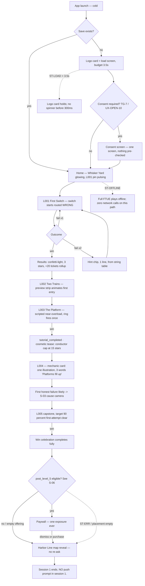

**Layout intent.** Home on first run is a single full-bleed district map, camera parked on Whisker Yard. One pulsing affordance (L001 pin) inside the thumb band or reachable by thumb-arc; every other district reads as parked scenery. **No shop entry, no daily entry, no badges rendered in session 1** (`product_spec.md:298`) — see TG-3 for the Night Harbor tile conflict.

**Component inventory (new at this story):** logo/load card · consent screen (content TBD, TG-7) · district map canvas · level pin (states: locked-parked / available-pulsing / cleared-with-stars) · level intro sheet (level name + star thresholds + best score, `product_spec.md:329`) · hint chip (single line, hidden by default) · mechanic card (one illustration + ≤3 words) · results panel (score ticker, star pops, ticket count-up, single `Next` CTA).

**Copy draft.** Tutorial levels render **zero** tutorial text, zero hand icons, zero modals — this is a hard content rule, testable as a string-table assertion (`product_spec.md:273-274`). The only strings that may appear in L001–L003: level name, score, `Next`, and the fail-fallback hint chip after 2 fails. Mechanic card at L004 **[DRAFT]** headline: "Platforms fill up" (3 words, locked count; the illustration carries the rest).

**Interaction behavior.** L001's switch starts on the wrong route (`initialRoute:1`) and pulses; the first tap is the entire lesson. `minActionWindowTicks:16` (2 s) means the player cannot lose it by being slow. L003's ring fires once with enough slack that any tap saves it — alarm without failure.

**Platform-convention notes.** Cold start ≤3.5 s to Home with the logo card doubling as the load screen [PC-1 launch-screen guidance analog; budget from `architecture.md:94`]. No permission dialog of any kind before value — Android 13+ POST_NOTIFICATIONS is a two-attempt budget and session 1 spends none of it [PC-4]. Predictive back on Home pops the screen stack; on the first Home there is nothing to pop, so back exits normally [PC-3].

**States.**

| State | Behavior |
|---|---|
| `ST-EMPTY` | Home with zero progress is not "empty" — it is the parked-districts diorama with one pulsing pin. Explicitly **not** a lock-icon grid. |
| `ST-LOAD` | Logo card until Home is interactive. If >3.5 s (low tier budget 5.0 s), the card stays; **no** spinner, **no** progress bar (avoids advertising slowness). |
| `ST-ERR` | Save-load failure → new-game path + one snackbar **[DRAFT]** "Couldn't read your save — starting fresh. Your purchases restore from Settings." Never a modal wall at first launch. |
| `ST-OFFLINE` | Entire FTUE is offline-complete. No network call may block any step L001–L005. |
| `ST-PENDING` | N/A on this path (no commerce before L5 win) — assert-able: attempt to construct a commerce surface during L001–L005 is a test failure (CM-R19.2). |
| `ST-RESTORE` | Reachable only from Settings in session 1; never surfaced proactively. |
| `ST-NOFILL` | N/A — no ad surface exists before L007/L5. |
| `ST-PERMDENY` | N/A in session 1 by design (CM-R40.1). |

**Accessibility acceptance criteria (testable).**

- `A11Y-S01-1` With TalkBack on, Home announces each district pin as `"{district name}, {n} of 5 levels cleared, {stars} stars, button"`; the pulsing L001 pin additionally announces `"available"`. Focus order: level pins in play order, then bottom-band chrome. *(fails if any pin is unlabelled or announced as "Button" alone)*
- `A11Y-S01-2` The L001 pulse is not the only affordance: the available pin also differs in **shape/size state** (raised ring) so an animation-off player still identifies it. Verify with Settings motion toggle OFF **and** OS animator scale 0.
- `A11Y-S01-3` No tutorial step requires hearing. Play L001–L003 with device volume 0 and confirm 100% of teaching signals (wrong-route arm, pulse, preview strip entry, ring) are visible. Written checklist, reviewer-signed (CM-R18.3).
- `A11Y-S01-4` Every interactive element in the FTUE measures ≥48×48dp on the 360×640dp reference, including the results `Next` CTA and the hint chip. Automated UI enumeration.
- `A11Y-S01-5` The hint chip is announced as a live region (polite) when it appears; it does not steal focus mid-run.
- `A11Y-S01-6` Cold-start to first interactive frame does not depend on a screen-reader-only path (i.e. TalkBack on does not add >500 ms to cold start).
- `A11Y-S01-7` L001–L003 pass the deutan/protan/tritan simulation with color removed entirely: the correct route is still derivable from symbol + silhouette + arm direction (CM-R21.3).

---

### S-02 — Core play screen (switch tap · wave preview · overload ring · purr meter)

**Traces:** CM-R07 (single verb, ≤50 ms, thumb zone), CM-R17 (preview + ring), CM-R18 (chime chain, purr meter P0, mute-friendly), CM-R21 (triple coding), CM-R22 (planning pause), CM-R01/R02 (determinism).
**Precedent:** the overcrowding countdown ring around a failing station is Mini Metro's shipped signature; pausing the sim while remaining able to edit routes is also shipped in Mini Metro (mobile). Wave/enemy preview strips are shipped in Plants vs. Zombies and Into the Breach.

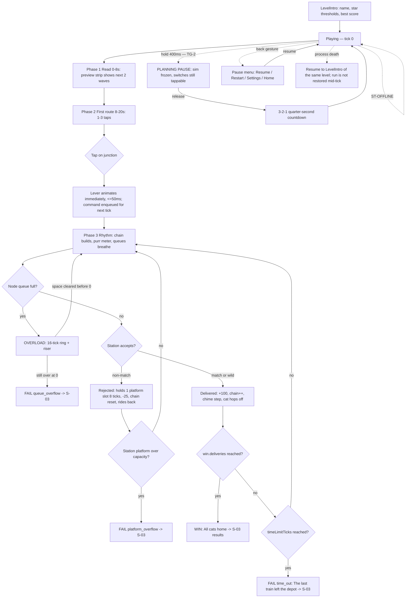

**Layout intent.** Three bands, no overlap. Top 0–15%: preview strip (next 2 waves as color+symbol+silhouette chips), level name, live score, chain/purr meter. 15–75%: board. Bottom 25%: pause button (left), planning-pause affordance if TG-2 lands on an explicit control, nothing else during Playing — the thumb band stays deliberately empty so the thumb never occludes the board. No commerce or ad surface can be constructed in phases 1–4 (CM-R19.2).

**Component inventory.** Preview strip chip (line color fill + symbol glyph + cat silhouette + count badge) · station kiosk (awning in line color + giant symbol sign) · switch lever disc (thrown-direction arm readable at 6 mm) · train capsule with cat-ear cab · node queue bubble (fill count 1–8, "breathing" scale) · overload countdown ring (16-tick sweep + numeric?/see below) · chain/purr meter · score readout · pause button.

**Copy draft.** In-run text is near-zero by design. Only: level name, score, `PAUSED`, pause-menu items. Fail strings are S-03's. **[LOCKED]** win banner "All cats home!"; fail strings "Platform overflowed at {node}" / "{station} platform overflowed" / "The last train left the depot" (`product_spec.md:251-256`) — note these differ in voice from `monetization_spec.md:173`; see TG-5.

**Interaction behavior.**
- **Tap** a junction → lever animates *immediately* (≤50 ms perceived), command applies at the next tick boundary. The visual must not lie: the arm shows the *committed* new route, and if two taps land inside one tick the last one wins in receipt order.
- **Hit rect** = expanded disc, ≥48dp radius equivalent, expanded beyond the drawn lever. Overlapping zones resolve to nearest center, deterministically.
- **Overload ring**: 2 s of real time. Non-color-coded redundancy required — the ring must also *sweep* (position encodes time) and the node must gain a distinct shape state (raised alarm collar), because Alarm Coral alone violates SC 1.4.1 [PC-7].
- **Planning pause**: sim freezes, switches remain tappable, release resumes after a 3-2-1 quarter-second countdown. The countdown itself is a timing element — it must be visible and must not be the only signal that play has resumed (add a board-desaturation lift). See TG-2 for where the hold lives.
- **Back gesture** → pause menu, never an exit [PC-3].

**Platform-convention notes.** One gesture handler only; no drag/pinch/long-press-to-aim/multi-touch (`product_spec.md:187`). The 400 ms hold sits **below** Android's 500 ms long-press default, so it must be implemented as a first-class gesture with its own threshold, and it must not fire when TalkBack's explore-by-touch is active (TalkBack's double-tap-and-hold pass-through would otherwise collide) [PC-1][PC-8].

**States.**

| State | Behavior |
|---|---|
| `ST-EMPTY` | N/A — a level always has a board. A level that would render an empty board is a validator failure (connectivity stage, CM-R12.6). |
| `ST-LOAD` | LevelIntro → Playing must not show a spinner; the board is a JSON DTO load. If it exceeds 300 ms, hold LevelIntro (which is content, not a spinner). Retry path budget is <1 s end-to-end (CM-R16). |
| `ST-ERR` | Level DTO fails to parse / content-hash mismatch → do not enter Playing. Return to map with **[DRAFT]** "That route's under maintenance — we skipped you ahead." + log. Never a crash, never a half-board. |
| `ST-OFFLINE` | Fully playable. Zero network dependency inside Playing. Analytics buffer to the offline queue (CM-R43.4). |
| `ST-PENDING` | A purchase pending from an earlier screen shows **no** UI during Playing. It surfaces only at Results/Home. |
| `ST-RESTORE` | Not reachable from Playing; pause menu → Settings → Restore is the path (never inside the run). |
| `ST-NOFILL` | N/A — no ad surface exists in phases 1–4 by invariant. |
| `ST-PERMDENY` | N/A. No permission surface may appear during a run. |

**Accessibility acceptance criteria (testable).**

- `A11Y-S02-1` **Triple coding, color-removed:** with the board rendered in greyscale, a tester correctly identifies all five lines (train, station, preview chip, queue bubble) by symbol + silhouette alone, 5/5 elements, on the 360×640dp device. Merge gate for palette changes (CM-R21.2-3).
- `A11Y-S02-2` **Non-text contrast:** every line-colored element meets ≥3:1 against its adjacent board surface, measured per TG-1's chosen rule (outline-measured or re-tuned hexes). Automated palette check in CI; current Day-board measurements: yellow 1.42:1 and green 2.59:1 **fail** unmodified.
- `A11Y-S02-3` **Overload is legible without color and without sound:** with volume 0 and greyscale, a tester identifies the overloading node and the time remaining within 500 ms of ring onset. The ring encodes time by sweep position, not hue.
- `A11Y-S02-4` **Chain/purr state is visible when muted:** at chain ≥3 the purr visual (tail-sync + meter step) activates identically with audio disabled (CM-R18.2).
- `A11Y-S02-5` **Tap targets:** every junction's effective hit rect ≥48dp on 360×640dp; mis-tap rate <3% over the 5-tester fat-finger gate; junction centers ≥1.2 grid units apart (validator).
- `A11Y-S02-6` **Action-window floor:** no shipped level has a solution requiring a decision window <6 ticks (750 ms); onboarding uses 12–16 ticks. Validator stage 6, merge-blocking.
- `A11Y-S02-7` **Planning pause is deterministic:** a run using planning pause produces a replay-hash-stable outcome identical to the same command sequence without it (freeze must not read the wall clock inside the tick).
- `A11Y-S02-8` **Planning pause resume is not timing-critical:** the 3-2-1 countdown is announced to screen readers (polite) and the resume moment is signalled by ≥2 channels (countdown numerals + board desaturation lift). WCAG 2.2 SC 2.2.1 spirit [PC-7].
- `A11Y-S02-9` **Motion-off parity:** with motion off, queue "breathing", riser shake, confetti and camera easing are removed while every state (queue fill count, overload time, chain step) remains readable as static values. No information loss — reviewer-signed checklist.
- `A11Y-S02-10` **HUD screen-reader nodes:** score, chain step, and overload alert exist as accessibility nodes; overload fires an assertive live-region announcement `"Overload at {node}, {n} seconds"`. Board internals are out of scope per §1.3 / `UX-OPEN-11`.

---

### S-03 — Fail → cause-first camera → sub-1s retry (and the win/results twin)

**Traces:** CM-R03 (three fail reasons), CM-R15 (cause camera), CM-R16 (retry <1 s, live during replay), CM-R19.3 (one primary CTA), CM-R08.1 (attempt-1 embargo).
**Precedent:** "show me what killed me" post-failure replay is the shipped killcam grammar (Call of Duty and successors); Mini Metro's shipped game-over focuses the camera on the overcrowded station. Sub-second retry is the shipped Super Meat Boy / Celeste standard. The **blame chip text** ("This blue cat needed the switch flipped here") has no precedent I can name — flagged **EXPERIMENTAL**, and it is exactly what the 20/20 scripted-scenario gate exists to de-risk.

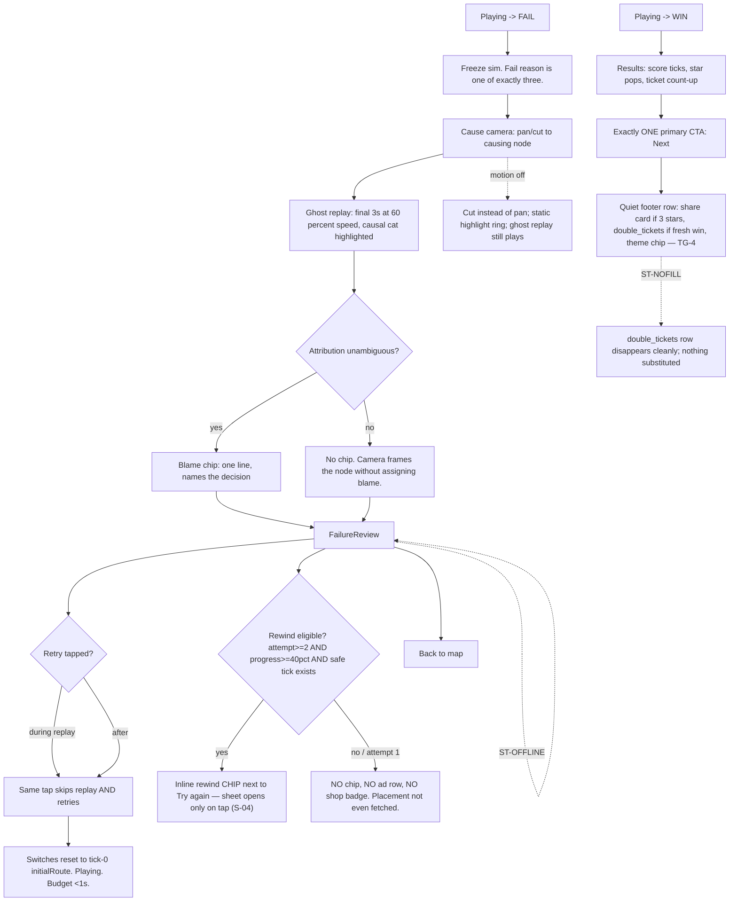

**Layout intent (FailureReview).** Board stays on screen — the cause is on the board, not in a dialog. The camera reframes; a translucent scrim never covers the causal node. Thumb band carries `Try again` (primary, full-width) and, when eligible, the `⏪ Rewind` chip **beside** it at lower visual weight, plus `Back to map` as a text button. The blame chip floats near the causal node inside the board rect but must not occlude it.

**Component inventory.** Cause camera controller · ghost-replay layer (60% speed, causal cat highlighted, everything else desaturated) · blame chip · fail-reason banner · `Try again` primary CTA · `⏪ Rewind` chip (conditional) · `Back to map` text button · results panel (score ticker / star pops / ticket count-up / `Next` / quiet footer row).

**Copy draft.** **[LOCKED]** fail reasons (`product_spec.md:251-256`) vs **[LOCKED-conflicting]** `monetization_spec.md:173` — TG-5 resolves. Blame chip pattern **[DRAFT]**: `"This {color} cat needed the switch flipped here."` Ambiguous case: **no chip at all** (locked behavior, `product_spec.md:338`). `Try again` **[LOCKED]** (`monetization_spec.md:173`). Results primary **[LOCKED]** `Next`.

**Interaction behavior.**
- `Try again` is hit-testable **from frame 1** of the ghost replay; the same tap both skips the replay and starts the retry. There is no separate "skip" control (one verb discipline).
- Retry restores switches to tick-0 `initialRoute`, never mid-run state — this is what keeps the Read phase meaningful on replays.
- Attempt 1 on **every** level, not just the first level ever: the `rewind_failure` placement is not fetched at all. Zero paywall/ad events must be emissible.
- Global 60 s no-offer window after any failure unless the player themself tapped the rewind chip.

**Platform-convention notes.** Snackbars/toasts are never used to carry failure cause (they auto-dismiss; the cause must persist until the player acts) [PC-9]. Back gesture from FailureReview = `Back to map`, matching Android's "back = up one level" expectation [PC-3].

**States.**

| State | Behavior |
|---|---|
| `ST-EMPTY` | N/A — a failure always has a cause node. If attribution returns nothing, render the ambiguous variant (camera on the failing node, no chip). This is the empty state. |
| `ST-LOAD` | None permitted. Failure → cause camera is a local computation over the command log; if it exceeds ~150 ms, ship the camera first and the chip when ready (chip animates in, never delays the retry). |
| `ST-ERR` | Cause attribution throws → fall back to ambiguous variant + log `error_caught`. **Never** block retry on attribution. |
| `ST-OFFLINE` | Full parity. Nothing in the fail/retry loop touches the network. |
| `ST-PENDING` | A pending purchase never renders on FailureReview. |
| `ST-RESTORE` | Not reachable here by design (no commerce surface in the fail path except the player-initiated rewind sheet). |
| `ST-NOFILL` | Applies to the results-screen `double_tickets` row only: it vanishes; no substitution, no explainer modal. |
| `ST-PERMDENY` | N/A. |

**Accessibility acceptance criteria (testable).**

- `A11Y-S03-1` `Try again` is reachable and activatable within **one** input from failure onset, including while the ghost replay plays; measured tap-to-Playing <1.0 s on mid **and** low tier.
- `A11Y-S03-2` The fail reason is announced assertively to screen readers on entry to FailureReview, using the authored string with the node/station substituted.
- `A11Y-S03-3` The blame chip is a screen-reader node adjacent in focus order to `Try again`, and the ambiguous variant announces the node without inventing blame text.
- `A11Y-S03-4` **Motion-off:** camera pan becomes a cut; ghost replay still runs (it is information, not decoration) but at motion-off the causal highlight is a static outline + symbol rather than a pulse. No information is lost — reviewer checklist.
- `A11Y-S03-5` **Mute:** fail thud and riser removed → the fail is still unambiguous from the banner + camera + chip within 1 s (checklist item in the mute audit, CM-R18.3).
- `A11Y-S03-6` The causal cat highlight does not rely on color alone: it carries an outline + symbol badge; verified in greyscale.
- `A11Y-S03-7` Focus order on FailureReview: fail banner (live region) → blame chip → `Try again` → `⏪ Rewind` (if present) → `Back to map`. No focus trap; back gesture always escapes.
- `A11Y-S03-8` Results screen focus order: score → stars → tickets → `Next` → footer row items. `Next` is the first *actionable* stop.
- `A11Y-S03-9` No auto-advancing timer on FailureReview or Results — the player leaves when they leave (WCAG 2.2 SC 2.2.1) [PC-7].
- `A11Y-S03-10` Star pips are shape-differentiated (filled/outline) not color-only, and announce as `"{n} of 3 stars"`.

---

### S-04 — Rewind offer sheet (eligibility-gated, player-initiated only)

**Traces:** CM-R08 (locked eligibility: attempt ≥2 AND progress ≥40% AND safe tick exists), CM-R35 (caps), CM-R36 (3-decline mute), CM-R29 (payer suppression), CM-R27 (ledger).
**Precedent:** rewind-to-a-safe-point is shipped in Forza Horizon (and the wider racing genre). Bottom-sheet, free-options-first ordering follows Material 3 bottom-sheet guidance [PC-2]. The *anti-pattern removals* (no auto-present, no exit-intent counter-offer, no countdown) are policy, not novelty.

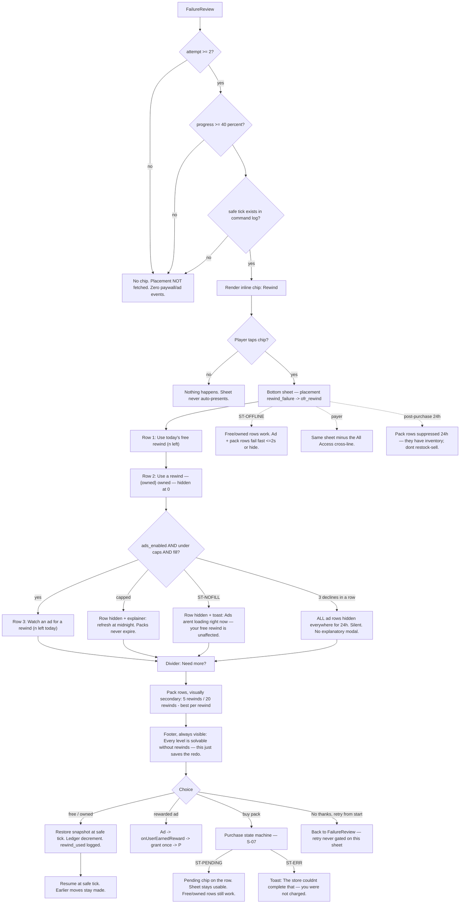

**Layout intent.** Material 3 modal bottom sheet [PC-2], ≤55% height, over a still FailureReview (board dimmed but the causal node stays visible so the offer stays *about the board*). Free/owned/ad rows are **identically styled** — no visual thumb on the scale. Pack rows are smaller, under the `Need more?` divider, below the fold of the free options. Footer fairness line is pinned, never scrolls away. Grabber + `✕` + swipe-down + back gesture all dismiss.

**Component inventory.** Chip (`⏪ Rewind`) · bottom sheet scaffold with grabber · option row (icon + label + count) ×3 · divider label · pack row ×2 (with the single permitted per-unit badge) · pinned footer line · dismiss text button · pending chip · cap explainer line · toast.

**Copy draft — all [LOCKED] from `monetization_spec.md:456-469`:** headline "Rewind to your last safe switch?" · context "Back to just before the {color} jam — your earlier moves stay made." · rows "Use today's free rewind ({n} left)" / "Use a rewind — {owned_count} owned" / "▶ Watch an ad for a rewind ({n} left today)" · divider "Need more?" · packs "5 rewinds — {localized_price}" / "20 rewinds — {localized_price} · best per rewind" · footer "Every level is solvable without rewinds — this just saves the redo." · dismiss "No thanks, retry from start". Cap explainer **[LOCKED]** "Out of ad rewinds for today — they refresh at midnight. Packs never expire."

**Interaction behavior.** The sheet **only** opens on chip tap. No auto-present, ever, in any state. Prices render from the store product string — never a hard-coded literal (CI regex gate). The 3-decline mute is **silent**: rows simply stop appearing for 24 h; no explanatory modal, no "are you sure". Any player-initiated ad tap clears the mute.

**Platform-convention notes.** Bottom sheet with drag handle, scrim, and swipe-to-dismiss is standard Material 3 [PC-2]; back gesture dismisses the sheet, not the screen [PC-3]. Pending purchases must not block the sheet — Play's pending state can resolve in a later session [PC-13].

**States.**

| State | Behavior |
|---|---|
| `ST-EMPTY` | If every row would be hidden (no free left, 0 owned, ads muted/capped, packs suppressed post-purchase), the sheet **must not open at all** — the chip is not rendered. An empty sheet is a bug, testable. |
| `ST-LOAD` | Offering fetch: skeleton rows for ≤2 s, then fallback. `rewind_failure` falls back to **nothing** (locked): if the placement resolves empty, the chip is not shown and the moment passes silently. |
| `ST-ERR` | Purchase failure → toast, sheet stays open, no retry modal, no counter-offer. Ad failure → `ST-NOFILL`. |
| `ST-OFFLINE` | Free + owned rows fully functional (ledger is local). Ad and pack rows hidden or fail-fast ≤2 s. Never a blocking error. |
| `ST-PENDING` | Pending chip on the purchased row; free/owned rows remain usable; balance credits exactly once when the purchase completes, even across process death. |
| `ST-RESTORE` | Not offered here (consumables are not restorable, and the copy must never imply they are). Restore lives in Shop/Settings/paywall footers. |
| `ST-NOFILL` | Ad row hidden + one toast; nothing substituted in its place. |
| `ST-PERMDENY` | N/A. |

**Accessibility acceptance criteria (testable).**

- `A11Y-S04-1` Sheet opens with focus on the headline; focus order is headline → context → free row → owned row → ad row → divider → pack rows → footer → dismiss. The footer fairness line is **in** the reading order, not decorative.
- `A11Y-S04-2` Every row's screen-reader label includes its cost and its remaining count: e.g. `"Use today's free rewind, 1 left, button"`, `"Watch an ad for a rewind, 3 left today, button"`, `"5 rewinds, {price}, button"`.
- `A11Y-S04-3` `✕` and every row are ≥48dp; the `✕` is at full opacity from frame 1 (no delayed or fading close).
- `A11Y-S04-4` Sheet is dismissible by back gesture, swipe-down, `✕`, and the text button — all four verified; no focus trap.
- `A11Y-S04-5` Free/owned/ad rows are indistinguishable in prominence: same height, same type scale, same background; automated snapshot diff of the three row styles.
- `A11Y-S04-6` No countdown, no timer, no preselected row exists in any state (contract test over the rendered tree).
- `A11Y-S04-7` The `⏪` glyph is never the only carrier of meaning — the row label carries the full sentence; verified with icons suppressed.
- `A11Y-S04-8` With TalkBack on, the cap-explainer and no-fill toast are announced (polite) and do not steal focus from an in-progress choice.

---

### S-05 — Level select / districts map

**Traces:** CM-R09.4 (sequential district unlock, stars gate nothing), CM-R10.4 (Night Harbor tile), CM-R13 (session-1 map), CM-R11.3 (Daily entry after L007).
**Precedent:** node-and-path level maps with per-pin star readouts are shipped everywhere in casual puzzle (Candy Crush, Angry Birds, Monument Valley chapter select). The parked-diorama-instead-of-lock-icons treatment is a taste variant of the same shipped pattern.

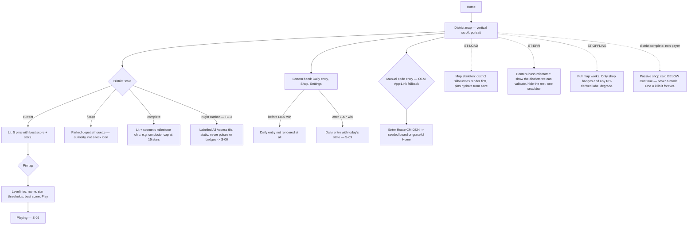

**Layout intent.** Single vertical-scroll map, one district per ~1.2 screens, camera parks on the current district on entry. Pins sized ≥48dp with a ≥8dp gap. Bottom band (thumb zone) holds the persistent entries: Daily (once unlocked), Shop, Settings. Scroll must not be required to reach the current district — entering Home always lands you on it.

**Component inventory.** District band (lit / parked / complete) · level pin (state: available / cleared with 1–3 stars / current) · best-score label · star pips · district milestone chip · Night Harbor tile (labelled, static) · Daily entry tile (states in S-09) · Shop button (badge max 1 per genuine content change, clears on open, never pulses) · Settings button · manual code entry field · district-complete celebration + passive shop card.

**Copy draft.** **[LOCKED]** district-complete card: "District {n} complete — your metro is growing. Everything Cat Metro sells lives in one small shop." CTA "Visit shop", dismiss `✕` (hides for all future districts, persisted). **[LOCKED]** Night Harbor tile label: "All Access". **[DRAFT]** parked district label: none — silhouette only (per TG-3 this may need a name).

**Interaction behavior.** Districts unlock sequentially by completing the previous district at **any** star count; stars gate nothing mechanically. Tapping a parked district does nothing except a soft bounce **[DRAFT]** — it must not open a paywall (only the Night Harbor tile does, and only because it is honestly labelled). Shop badge is capped and never animates.

**Platform-convention notes.** Back gesture pops the screen stack (LevelIntro → map → exit) [PC-3]. Scroll uses standard Android overscroll/fling; no custom physics. The passive shop card follows Material's "supporting content below the primary action" convention rather than a dialog [PC-2].

**States.**

| State | Behavior |
|---|---|
| `ST-EMPTY` | Zero-progress map = parked diorama + one pulsing pin (S-01). Never a grid of padlocks. |
| `ST-LOAD` | District silhouettes render immediately; pins/stars hydrate from the local save (should be <100 ms). No spinner. |
| `ST-ERR` | Level content fails validation/hash: hide the affected pins, render the rest, one snackbar **[DRAFT]** "Some routes are being repaired — they'll be back next update." Never a blank map. |
| `ST-OFFLINE` | Everything works. Only the Shop's price strings and any entitlement-derived label may show cached values; nothing is hidden. |
| `ST-PENDING` | If a purchase is pending, the affected tile (e.g. Night Harbor) shows a quiet "Pending" chip rather than unlocking or erroring. |
| `ST-RESTORE` | Not on the map; reachable via Shop footer and Settings. |
| `ST-NOFILL` | N/A — no ad surface on the map. |
| `ST-PERMDENY` | N/A. |

**Accessibility acceptance criteria (testable).**

- `A11Y-S05-1` Every pin announces `"{level name}, {available|cleared}, {n} of 3 stars, best score {n}, button"`. Parked districts announce `"{district name}, opens after {district n-1}"` — never "locked" without a reason.
- `A11Y-S05-2` Night Harbor announces `"Night Harbor, bonus district, All Access, button"` — the entitlement requirement is in the label, not just the visual chip.
- `A11Y-S05-3` Focus order is linear and matches visual reading order: current district's pins in play order → other districts top-to-bottom → bottom band (Daily, Shop, Settings).
- `A11Y-S05-4` All pins and bottom-band entries ≥48dp with ≥8dp spacing; verified on 360×640dp and on the tablet tier with no scroll required for the bottom band.
- `A11Y-S05-5` Star pips distinguish filled/empty by **shape**, not fill color alone; verified greyscale.
- `A11Y-S05-6` District state (parked/lit/complete) is conveyed by silhouette + label, not luminance alone — greyscale test distinguishes all three.
- `A11Y-S05-7` The passive shop card is not in the primary focus path before `Continue`; `Continue` is the first actionable stop on the district-complete screen.
- `A11Y-S05-8` Manual code entry field: labelled `"Route code"`, accepts the `CM-0824` grammar, announces validation failures politely, and never blocks the map behind a modal.

---

### S-06 — Night Harbor paywall touchpoints (`post_level_5` + `bonus_district`)

**Traces:** CM-R26 (once-ever scripted exposure), CM-R10 (Night Harbor), CM-R25 (placement-first), CM-R29 (payer suppression), CM-R30 (refund suppression).
**Precedent:** celebratory chapter-boundary full-screen offer with a persistent close affordance is standard shipped mobile-premium practice; the anti-dark-pattern constraints (no countdown, nothing preselected, equal-weight decline, `✕` full opacity frame 1) are the Google Play policy floor plus our own stricter rules [PC-6 policy context].

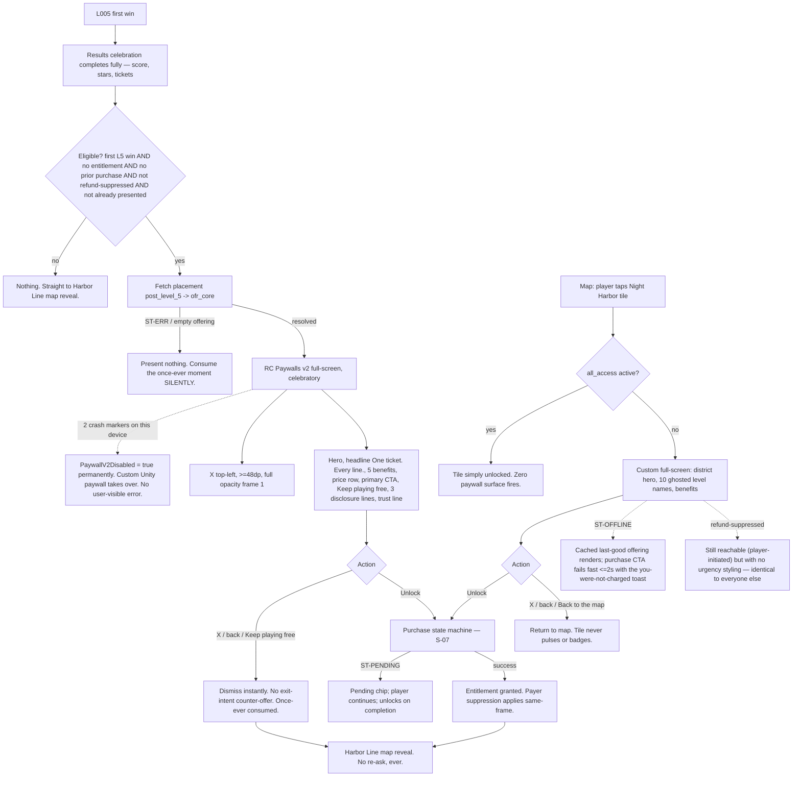

**Layout intent (`post_level_5`).** Full-screen, confetti continuity from Results. Top 35% hero (Night Harbor diorama render, no text overlay). `✕` top-**left** at ≥48dp — note this is the spec's choice and is *unconventional on Android*, where a close/up affordance top-left is fine but many full-screen offers use top-right; the spec is explicit, so top-left it is. Benefit list, price row, full-width primary CTA in the thumb band, `Keep playing free` directly below at the **same tap-target height**, then disclosures, then trust line. **The three disclosure lines must be visible without scrolling on 720p 16:9** — layout priority: if space runs out, the benefit list collapses from 5 rows to 4 (badge line drops) before any disclosure scrolls.

**Component inventory.** Hero image · `✕` · H1 · sub-head · benefit row ×5 (icon + text, one with a sub-line) · price row · primary CTA (localized price token) · secondary text CTA · disclosure block ×3 (third is tappable → Restore) · trust line · custom-fallback prefab with identical layout grammar.

**Copy — all [LOCKED] `monetization_spec.md:419-437`:** "One ticket. Every line." / "All Access is the complete Cat Metro — one purchase, yours forever." / benefits (Night Harbor 10 levels · both premium themes · daily free rewind doubled — 2 every day · "Ad-free, guaranteed forever" with sub-line "Cat Metro has no forced ads today. All Access makes that a permanent promise." · gold conductor badge) / "{localized_price} · one-time purchase" / "Unlock All Access — {localized_price}" / "Keep playing free" / "One-time payment. Not a subscription. No recurring charges." / "Every level outside Night Harbor is free and fully solvable without paying." / "Purchases restore on any device with your Google account." / "Fair by design: no forced ads, no energy, no loot boxes."
**`bonus_district` variant [LOCKED]:** headline "Night Harbor runs on All Access"; body "10 handcrafted night-shift levels — plus both themes, a doubled daily rewind, and a permanent ad-free guarantee. One purchase, yours forever."; CTA "Unlock All Access — {localized_price}"; secondary "Back to the map".

> **Carried defect (PRD NEW-Q2 / U-1):** the "permanent removal of ALL non-rewarded ad surfaces" benefit is meaningless when zero non-rewarded surfaces exist. The paywall copy above says "guaranteed forever… makes that a permanent promise", which is defensible; the *store listing* sentence is not. A human must reconcile before submission. Not resolvable here.

**Interaction behavior.** Fires **after** the celebration finishes (score counted, stars landed), before map return, first L5 completion only, never on replay. Once presented **or** dismissed, never re-arms — including after reinstall-with-same-save. Dismissal is instant on `✕`, back gesture, and the secondary CTA. No exit-intent surface may be constructible.

**Platform-convention notes.** Back gesture must dismiss the paywall (not exit the app) and must be swallowed once the purchase flow starts [PC-3]. Prices are always the store-rendered localized string [PC-13]. Google Play's policy bar on deceptive/persistent close affordances is the floor; our rules are stricter.

**States.**

| State | Behavior |
|---|---|
| `ST-EMPTY` | Placement resolves empty → present nothing and consume the once-ever moment silently. No error, no retry, no fallback offering (locked fallback policy for this placement is "current → cached last-good"; if both are empty, nothing). |
| `ST-LOAD` | Open-to-render budget ≤2.0 s on mid tier. If the offering is still loading when the celebration ends, do **not** hold the player — proceed to the map and consume the moment. Never a spinner between win and map. |
| `ST-ERR` | Paywalls v2 crash/exception: 2 armed markers on a device set `PaywallV2Disabled=true` permanently and the custom paywall takes over silently. Purchase errors → S-07 rules. |
| `ST-OFFLINE` | Cached last-good offering may render (bonus_district/shop only); purchase CTA fails fast ≤2 s with the "you were not charged" toast. For `post_level_5`, offline at the moment = present nothing, consume silently. |
| `ST-PENDING` | Pending chip; the player proceeds to the map; entitlement applies on completion in this or a later session. |
| `ST-RESTORE` | Third disclosure line is tappable → Restore (S-07). Present on every paywall footer, required. |
| `ST-NOFILL` | N/A — no ad row on these surfaces. |
| `ST-PERMDENY` | N/A. |

**Accessibility acceptance criteria (testable).**

- `A11Y-S06-1` `✕` is ≥48dp, at full opacity, focusable and activatable **from frame 1**; automated test asserts opacity==1 and hit-testable at first rendered frame.
- `A11Y-S06-2` Focus order: `✕` → headline → sub-head → benefits (in order) → price → primary CTA → secondary CTA → disclosures → trust line. The `✕` is the **first** focus stop.
- `A11Y-S06-3` All three disclosure lines are rendered on-screen without scrolling at 360×640dp; automated layout assertion at that resolution with the largest supported system font scale.
- `A11Y-S06-4` Text scales with the OS font-size setting to at least 130% without truncating any disclosure line or clipping the CTA label; the benefit list is what collapses (5→4 rows), per the locked layout-priority rule.
- `A11Y-S06-5` Primary and secondary CTAs have the same tap-target height; the decline is neutral in wording and not visually de-emphasized below 60% of primary contrast.
- `A11Y-S06-6` Every benefit row's meaning survives icon removal (icons are decorative, marked as such for screen readers; text carries the content).
- `A11Y-S06-7` Contrast: all body text ≥4.5:1 and all UI affordances ≥3:1 against their backgrounds, on **both** Day and Night palettes (WCAG 2.2 SC 1.4.3/1.4.11) [PC-7].
- `A11Y-S06-8` No timer, no countdown, nothing preselected — contract test over the rendered tree in both the RC Paywalls v2 config and the custom fallback prefab.
- `A11Y-S06-9` Back gesture dismisses; a screen-reader user can dismiss without locating the `✕` visually.

---

### S-07 — Shop + Restore + purchase state machine

**Traces:** CM-R23 (catalog/prices), CM-R25 (placement-first), CM-R27 (ledger), CM-R28 (restore), CM-R29 (payer suppression), CM-R30 (refund), CM-R32 (state machine + copy).
**Precedent:** a single-scroll catalog with a persistent restore footer is the shipped iOS/Android premium-game convention; Play's own guidance requires a restore path for non-consumables [PC-13].

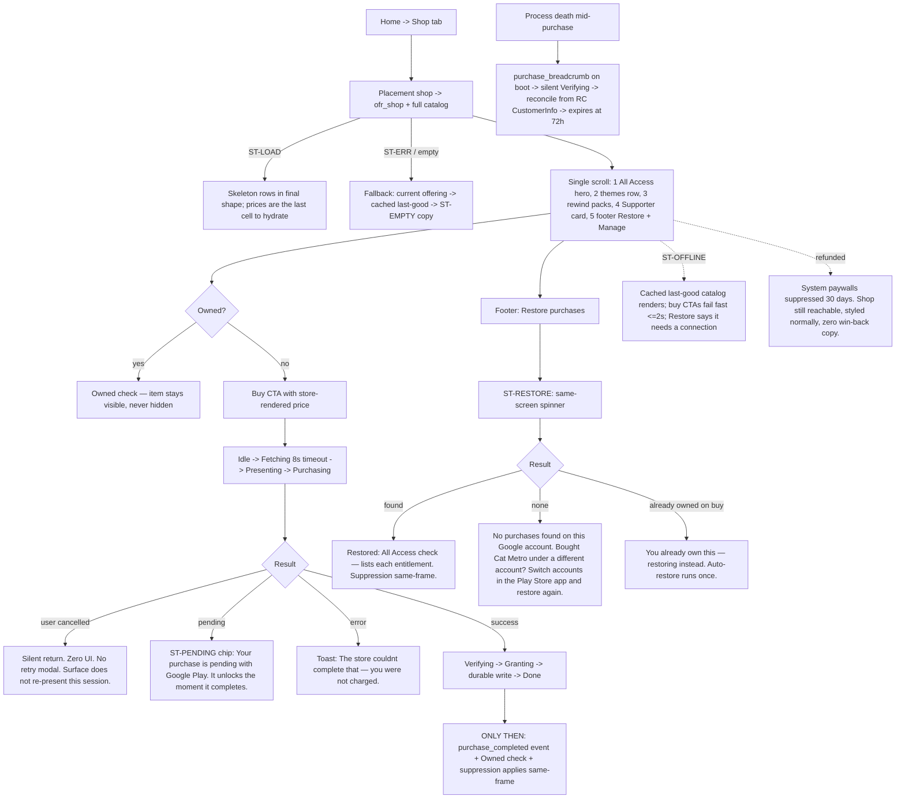

**Layout intent.** One vertical scroll, calm and catalog-like, ordered exactly: All Access hero → themes row → rewind packs → Supporter card → footer (Restore + Manage). Buy CTAs sit within each card, not in a global bottom bar (multiple products, no single primary action). The Restore footer must be reachable without hunting: it is the last item and also duplicated in Settings and every paywall footer (three entry points, locked).

**Component inventory.** All Access hero card (condensed §4.1) · theme tile ×2 with `Preview` link (→ S-08) · rewind pack row ×2 · Supporter card (with honesty line) · Owned ✓ state · Pending chip · Restore row · Manage link · trust footer line · toast.

**Copy — [LOCKED]:** themes "Sakura Line — {price}" / "Neon Line — {price}" / "Preview"; rewinds "5 rewinds — {price}" / "20 rewinds — {price} · best per rewind"; footer trust "Fair by design: no forced ads, no energy, no loot boxes."; Supporter honesty line "If you just want the content, All Access is the better buy. This one's for people who want to keep the depot lights on."; payer-reframed Supporter body per `monetization_spec.md:333`. Error/pending/restore strings as in §1.2.

**Interaction behavior.** Prices come from `StoreProduct.PriceString` only — the CI regex gate fails the build on any currency symbol or `\d\.\d\d` literal in shop/paywall strings. Owned items show `Owned ✓` and are never hidden. The shop badge appears at most once per genuine content change, clears on open, never pulses. Zero automatic purchase retries; offering fetch retries exactly 3× at 1/4/10 s. From `Purchasing` onward the sim is paused and back is swallowed.

**Platform-convention notes.** Play pending purchases must be represented as a non-blocking state that can resolve in a later session [PC-13]. "Manage" should route to the Play subscriptions/purchase management surface — note we sell **no subscriptions**, so `Manage` here means order history/refund help; wording must not imply a subscription (`UX-OPEN-06`).

**States.**

| State | Behavior |
|---|---|
| `ST-EMPTY` | Catalog resolves empty (all fallbacks exhausted): render the trust line + Restore footer + **[DRAFT]** "The shop can't reach Google Play right now. Your purchases are safe — try Restore." Never a blank tab. |
| `ST-LOAD` | Skeleton rows in the final layout shape; prices hydrate last so the layout never jumps. Spinner only past 2 s. |
| `ST-ERR` | Inline toast, never a modal; the origin surface stays. Unknown RC error classes degrade to the generic safest path (treat as failure, "you were not charged"). |
| `ST-OFFLINE` | Cached last-good offering renders with cached prices; buy CTAs fail fast ≤2 s; Restore states it needs a connection **[DRAFT]** "Restore needs a connection — your purchases are still on your Google account." |
| `ST-PENDING` | Quiet "Pending" chip on the item; the rest of the shop stays fully usable; exactly-once credit on completion. |
| `ST-RESTORE` | Same-screen spinner → same-screen result; success lists each entitlement; suppression applies in the same frame; none-found renders the account-switch copy verbatim. Consumables are never described as restorable. |
| `ST-NOFILL` | N/A on the shop screen itself (no ad rows here); theme preview owns that case (S-08). |
| `ST-PERMDENY` | N/A. |

**Accessibility acceptance criteria (testable).**

- `A11Y-S07-1` Every purchasable row announces `"{item name}, {price}, button"`; owned items announce `"{item name}, owned"` and are **not** focusable as buttons.
- `A11Y-S07-2` `Restore purchases` is reachable by screen reader from shop footer, Settings, and every paywall footer — three independent paths verified.
- `A11Y-S07-3` Restore result is announced assertively (it is a state change the user asked for) and the restored items' `Owned ✓` state updates in the same frame.
- `A11Y-S07-4` The pending chip is announced as part of the item label (`"…, purchase pending"`), not as a color-only badge.
- `A11Y-S07-5` The purchase error toast is announced and its text states explicitly that no charge occurred.
- `A11Y-S07-6` All rows ≥48dp; the Supporter honesty line and trust footer are in the reading order (not marked decorative).
- `A11Y-S07-7` Text at 130% system font scale does not truncate any price, CTA label, or the honesty line.
- `A11Y-S07-8` During `Purchasing`, the back gesture is swallowed **and** the screen reader announces that a purchase is in progress rather than silently ignoring input.
- `A11Y-S07-9` No shop element pulses, badges, or animates to attract attention (contract test over animation clips on shop prefabs).

---

### S-08 — Theme preview + rental

**Traces:** CM-R25 (theme_preview placement, no fallback), CM-R35.5 (rental 3 levels, 1/theme/day), CM-R24.4 (equipped theme persists), CM-R21.4 (themes never change the a11y encoding), CM-R36 (decline mute).
**Precedent:** live-preview-behind-a-sheet (the board actually re-skins while you decide) is shipped in phone-launcher/theme stores and in games' cosmetic previews. **The 3-level rewarded rental is FLAGGED EXPERIMENTAL** — I cannot name a specific shipped title doing a level-counted cosmetic rental (TG-8).

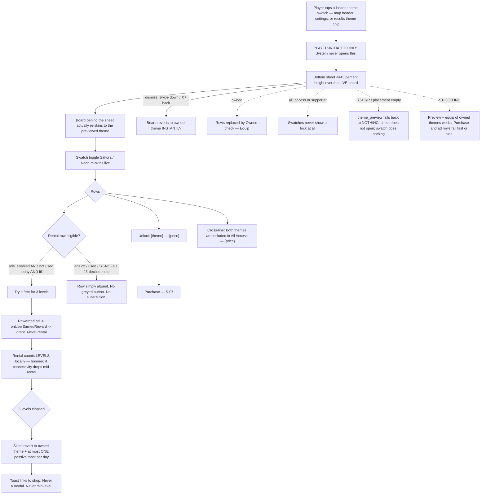

**Layout intent.** Bottom sheet capped at 45% height so the re-skinned board stays the hero — the product *is* the preview. Swatch toggle at the top of the sheet, inside the grabber row. Two action rows of **equal visual weight** (purchase and rental), then a small cross-line, then dismiss.

**Component inventory.** Theme swatch (locked/owned states) · bottom sheet with swatch toggle · action row ×2 · cross-line text link · `Maybe later` dismiss · rental counter (levels remaining, shown where? → `UX-OPEN-05`) · expiry toast.

**Copy — [LOCKED] `monetization_spec.md:441-452`:** "Ride the {theme_name}" / "The whole board repaints — stations, trains, sky. You're previewing it right now, behind this card." / "Unlock {theme_name} — {localized_price}" / "▶ Try it free for 3 levels" / "Both themes are included in All Access — {aa_localized_price}" / "Maybe later" / owned: "Owned ✓ — Equip". Expiry toast **[LOCKED-ish]** "That was the Sakura Line" + shop link (`monetization_spec.md:157`).

**Interaction behavior.** Opening is always player-initiated; the system may never open this sheet. Dismiss reverts the board instantly (no fade-out ambiguity about what you own). Rental expiry is a **silent revert plus at most one toast/day** — never a modal, never mid-level. A rented theme must not alter symbol/silhouette encoding in any way.

**Platform-convention notes.** Material 3 bottom sheet with drag handle and scrim; the scrim must be light enough that the live preview reads through it [PC-2]. Rewarded ads must be preceded by an explicit opt-in tap and rewarded only on `onUserEarnedReward` — the Google Mobile Ads rewarded convention.

**States.**

| State | Behavior |
|---|---|
| `ST-EMPTY` | Placement resolves empty → the sheet does **not** open (locked fallback for `theme_preview` is nothing). The swatch tap is a no-op; no error shown. Testable. |
| `ST-LOAD` | Board re-skin must be instant (materials are local). Only the price row waits; show a skeleton price, never a blocking spinner. |
| `ST-ERR` | Ad load error → `ST-NOFILL`. Purchase error → S-07 toast. Re-skin failure (missing material) → do not open; log. |
| `ST-OFFLINE` | Preview and equipping owned themes work fully (cached entitlements honored indefinitely). Purchase row fails fast ≤2 s; rental row hidden. |
| `ST-PENDING` | Theme purchase pending → "Pending" chip on the row; the preview remains available; the theme equips automatically when the purchase completes (**decision needed**: auto-equip or notify only → `UX-OPEN-05`). |
| `ST-RESTORE` | Cross-link only via the shop/settings footer; a theme owned on another install returns via Restore and equips per the saved equipped-theme field. |
| `ST-NOFILL` | Rental row disappears; one toast, this session only; nothing substituted. |
| `ST-PERMDENY` | N/A. |

**Accessibility acceptance criteria (testable).**

- `A11Y-S08-1` Equipping **any** theme leaves the symbol set and silhouette set byte-identical; automated asset test (CM-R21.4).
- `A11Y-S08-2` Each theme passes the deutan/protan/tritan simulation and the ≥3:1 non-text contrast bar **per theme**, on its own board base color — Neon is not enabled in `ofr_themes` until it passes (locked).
- `A11Y-S08-3` The swatch toggle announces the current selection state (`"Sakura Line, selected"` / `"Neon Line, not selected"`), and toggling announces the live preview change politely.
- `A11Y-S08-4` The two action rows are equal in tap-target size and prominence; snapshot diff.
- `A11Y-S08-5` The rental row's label carries its full cost and limit: `"Watch an ad to try Sakura Line free for 3 levels, button"`.
- `A11Y-S08-6` Rental expiry never interrupts play: contract test asserts the expiry toast cannot render while state == Playing.
- `A11Y-S08-7` Remaining-rental count is available to a screen reader wherever it is displayed (once `UX-OPEN-05` decides where that is).
- `A11Y-S08-8` Dismissing restores the previous theme within one frame; no flash of a third state.

---

### S-09 — Daily Line entry

**Traces:** CM-R11 (seeded daily, L007 unlock, one scoring play), CM-R46 (pre-validation + backup pool), CM-R54 (share card), CM-R35.4 (`double_tickets` after a fresh win).
**Precedent:** one identical board per calendar date worldwide + a spoiler-free share card is the shipped Wordle/NYT Games pattern. Practice-replays-don't-score is the shipped daily-puzzle convention.

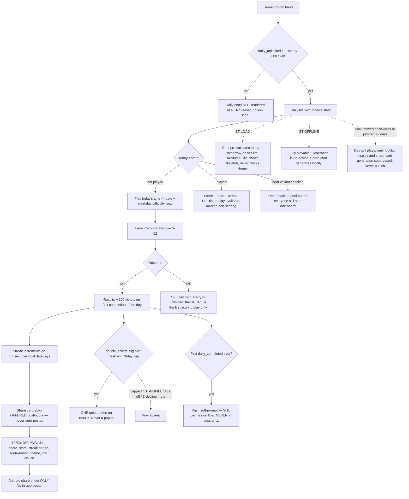

**Layout intent.** Daily tile lives in the Home bottom band (thumb zone), sized ≥48dp with the date and one state line. Post-score, the share affordance is a single quiet button on Results — it never pre-empts `Next`/`Back to map` (TG-4).

**Component inventory.** Daily tile (states: unavailable-not-rendered / today-unplayed / today-played / backup-board / clock-suspect) · daily intro card (first unlock only) · practice badge · streak badge (bronze/silver/gold/opal) · share-card composite + preview · share button · `double_tickets` quiet button.

**Copy draft.** **[DRAFT]** tile unplayed: "Today's Line — {weekday}". **[DRAFT]** tile played: "Done — {score} · {n}-day streak". **[DRAFT]** practice: "Practice run — doesn't score." **[DRAFT]** backup-pool board: no special copy (the player must not be told they got a substitute; everyone gets the same substitute — but see `UX-OPEN-04`, this is a transparency call for the human).

**Interaction behavior.** One scoring play per local date; unlimited practice replays marked non-scoring. Streak keys on consecutive `dateKey` values, never on elapsed hours — a timezone/DST change can delay an increment but can never reset a streak. Share is offered, never automatic, and the card contains no PII.

**Platform-convention notes.** Use the Android system share sheet (`ACTION_SEND` with an image + text), not a custom picker — the spec forbids in-app social entirely. Deep links `catmetro://daily` (and the `?d=&b=` share form, which is **not** in the registered route list — PRD NEW-Q15) route through the central router with a safe fallback to Home [PC-3 for intent handling].

**States.**

| State | Behavior |
|---|---|
| `ST-EMPTY` | Pre-L007: the entry does not exist at all (not a greyed tile). Post-L007, "already played today" is a *content* state (score + practice option), not an empty state. |
| `ST-LOAD` | Boot validation of today + tomorrow is budgeted ≤200 ms and must never block Home interactivity; the tile shows a skeleton until resolved. |
| `ST-ERR` | Today's generated board fails validation → dated backup pool serves the board; if that also fails, the tile shows **[DRAFT]** "Today's Line is being re-routed — back shortly." and the `daily_enabled` flag can dark the mode entirely. |
| `ST-OFFLINE` | Fully functional: generation, validation, scoring, streak, and share-card composition are all on-device. |
| `ST-PENDING` | N/A (no commerce on this surface beyond the results-footer `double_tickets` row). |
| `ST-RESTORE` | N/A. |
| `ST-NOFILL` | `double_tickets` row disappears; nothing substituted; the base ticket reward is unaffected. |
| `ST-PERMDENY` | Push denied → the daily reminder degrades to a local notification where the OS permits, and the tile never nags. No re-prompt. |

**Accessibility acceptance criteria (testable).**

- `A11Y-S09-1` The Daily tile announces its full state: `"Today's Line, {weekday}, not played, button"` / `"Today's Line, completed, score {n}, {n} day streak, button"`.
- `A11Y-S09-2` Practice runs are announced as non-scoring at level start (polite live region), not only shown as a badge.
- `A11Y-S09-3` The streak badge announces tier and count (`"Bronze collar tag, 3 day streak"`); tiers differ by **shape**, not color alone (greyscale test).
- `A11Y-S09-4` The share card is offered by a labelled button (`"Share today's result, button"`); sharing is never automatic and never triggered by a gesture the player did not aim at.
- `A11Y-S09-5` The share card image carries alt text in the share intent (`EXTRA_TEXT` includes the human-readable result) so a recipient using a screen reader gets the result without OCR.
- `A11Y-S09-6` Route-ribbon and theme colors on the card are never the only carrier of the result — date, score, stars and streak are text.
- `A11Y-S09-7` `double_tickets` renders as a single quiet button with a full label (`"Watch an ad to double today's tickets, {n} of 3 left today"`), never as a popup or an auto-play.

---

### S-10 — Streak, daily gift, comeback grants

**Traces:** CM-R49 (comeback ladder gives, never asks), CM-R35 (`daily_gift_double`, `streak_saver`), CM-R42 (local streak backup), CM-R11.5 (streak keying).
**Precedent:** streak + repair token is the shipped Duolingo pattern (Streak Freeze); "paused, not lost" framing is our softer variant of the same shipped mechanic.

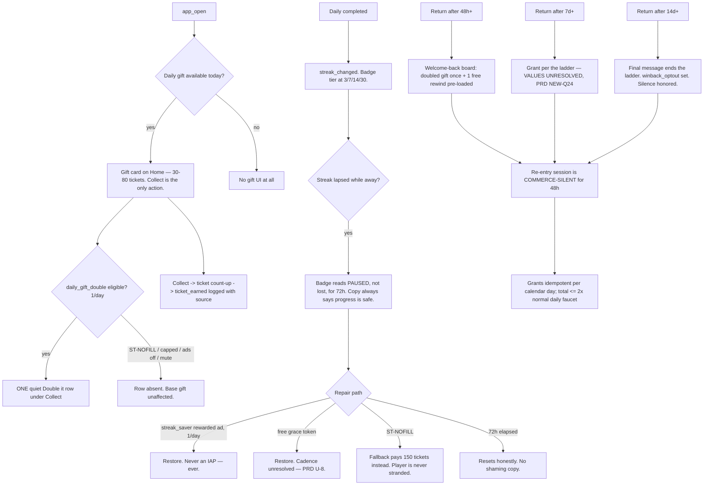

**Layout intent.** The gift is a card on Home in the thumb band with exactly one primary action (`Collect`); the `Double it` rewarded row sits under it at lower weight and vanishes cleanly when unavailable. The streak badge lives on the Daily tile and on the share card — never as a standalone anxiety widget.

**Component inventory.** Daily gift card · `Collect` CTA · `Double it` quiet row · ticket count-up · streak badge (4 tiers, shape-differentiated) · "paused" badge state · streak-repair sheet · welcome-back board/card · retuned-routes screen (14 d, P1).

**Copy draft.** **[DRAFT]** gift card: "Your daily gift is at the depot." CTA "Collect". **[DRAFT]** paused streak: "Your {n}-day streak is paused — you have {hh} hours to pick it back up. Nothing else is at risk." (must satisfy the locked rule that streak copy always says progress is safe). **[LOCKED-adjacent]** no-fill fallback pays 150 tickets (`economy_sources_and_sinks.csv:19`).

**Interaction behavior.** Every comeback path **gives**; none asks. Purchases may appear only in the rewind sheet's secondary row — never in a gift, streak, or comeback surface. Grants are idempotent per calendar day and share one cap (≤2× the normal daily faucet).

**Platform-convention notes.** The streak-expiry reminder is a **local** notification (Unity Mobile Notifications) scheduled at a time that is currently specified two different ways (PRD NEW-Q17) — it must be cancelled on next daily completion/app open and de-duplicated against the remote message [PC-4 for the permission gate on Android 13+].

**States.**

| State | Behavior |
|---|---|
| `ST-EMPTY` | No gift today → no card at all (not an empty card). No streak → no badge (not a "0-day streak" widget — that is loss-framing). |
| `ST-LOAD` | Gift availability is local state; no loading state permitted. |
| `ST-ERR` | Grant write fails → the grant is retried on next boot from the ledger; the player is never shown a failed-grant error. Idempotence makes double-credit impossible. |
| `ST-OFFLINE` | All gift/streak/comeback logic is local and offline-safe; only the rewarded double/save rows degrade. |
| `ST-PENDING` | N/A. |
| `ST-RESTORE` | N/A. |
| `ST-NOFILL` | `daily_gift_double` row vanishes (base gift unaffected). `streak_saver` no-fill pays the 150-ticket fallback so the player is never stranded by ad availability. |
| `ST-PERMDENY` | Streak reminders degrade to local notifications where permitted; if denied entirely, no reminder and no nag — the badge state on Home is the only surface. |

**Accessibility acceptance criteria (testable).**

- `A11Y-S10-1` The gift card announces the amount before the action: `"Daily gift, {n} tickets, Collect, button"`.
- `A11Y-S10-2` The `Double it` row states it is an ad and its cap: `"Watch an ad to double your gift, 1 left today, button"`.
- `A11Y-S10-3` Streak tiers are distinguishable in greyscale by badge shape; each announces tier name + day count.
- `A11Y-S10-4` The paused-streak state announces the remaining window and explicitly that nothing else is at risk (copy contract test on the string, not just presence).
- `A11Y-S10-5` No streak or comeback surface uses a countdown timer as its primary pressure device; the 72 h window is stated in text and never renders as a ticking clock (locked anti-dark-pattern rule).
- `A11Y-S10-6` Ticket count-up animation respects motion-off: with motion off, the final value renders immediately and is announced once.

---

### S-11 — Settings (a11y toggles · notifications · mute · restore · reset · help)

**Traces:** CM-R22.3 (haptics/motion toggles persist), CM-R40 (permission budget), CM-R53 (reset progress, help/refund route, in-app review discipline), CM-R28.1 (restore entry point), CM-R50.6 (privacy policy URL parity).
**Precedent:** a single-screen settings list with grouped switches is the Android/Material standard [PC-2]; `fallbackToSettings` deep-link-to-app-settings for a spent permission budget is the documented Android 13+ pattern [PC-4].

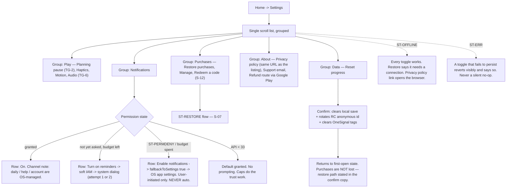

**Layout intent.** One scroll, grouped, switches right-aligned, each row ≥48dp with the label as the tap target (not just the switch). Destructive `Reset progress` is last, visually separated, and requires a confirm that states purchases survive.

**Component inventory.** Switch row (planning pause / haptics / motion / audio — pending TG-2, TG-6) · notification row (4 permission states) · restore row · manage link · redeem-a-code row · privacy/support/refund rows · reset-progress row + confirm dialog.

**Copy draft.** **[DRAFT]** "Planning pause — hold to freeze the board while you think." **[DRAFT]** "Haptics" / "Reduce motion". **[DRAFT]** notifications, budget-spent: "Enable notifications" → opens system settings. **[LOCKED-tone]** the public cap statement must read "a daily nudge, plus a streak warning if one's at risk — never at night" (`EXECUTION_PLAN.md:156-157`) — this supersedes "at most one reminder a day". **[DRAFT]** reset confirm: "This clears your progress on this device. Purchases stay on your Google account — use Restore purchases to get them back."

**Interaction behavior.** No setting is behind a sub-screen. Every toggle persists across restart and process death, and takes effect immediately (no "apply"). The in-app review prompt has **no** Settings entry and no visible CTA anywhere — it is called from exactly one code site, never after a failure, never in the same session as a paywall or an ad, and the UI must never branch on its callback [PC-5].

**Platform-convention notes.** Android 13+ POST_NOTIFICATIONS is a two-dialog budget; after it is spent the only legitimate path is a user-initiated jump to app settings [PC-4]. Play's in-app review API guidance forbids incentivized or interruptive prompting and warns the quota may silently no-op [PC-5]. There is no account system, so "delete account" is N/A — `Reset progress` is the product-level answer.

**States.**

| State | Behavior |
|---|---|
| `ST-EMPTY` | N/A — settings always has content. |
| `ST-LOAD` | None; all values are local. Entitlement-derived rows (e.g. "All Access — owned") render from cache instantly. |
| `ST-ERR` | A failed persist reverts the switch visibly + snackbar **[DRAFT]** "Couldn't save that setting — try again." Never a silent revert. |
| `ST-OFFLINE` | All toggles work. Restore states it needs a connection. Privacy/support links open the browser/mail client and fail gracefully if none exists. |
| `ST-PENDING` | If a purchase is pending, the Purchases group shows the pending chip rather than an owned/not-owned lie. |
| `ST-RESTORE` | Full flow per S-07, rendered inline in the Purchases group. |
| `ST-NOFILL` | N/A. |
| `ST-PERMDENY` | The notification row switches to the `fallbackToSettings` variant; it never re-triggers a system dialog and never appears as an error. |

**Accessibility acceptance criteria (testable).**

- `A11Y-S11-1` Every switch announces role + state (`"Haptics, switch, on"`) and toggles via the whole row, not just the thumb.
- `A11Y-S11-2` Turning **motion off** removes easing/parallax/confetti app-wide within the same session and persists across restart; automated test asserts zero animation clips play on a sampled set of screens.
- `A11Y-S11-3` Turning **haptics off** results in zero haptic API calls (instrumented counter == 0 over a scripted playthrough).
- `A11Y-S11-4` Planning-pause toggle state is honored by the Game scene immediately (no restart), and its label explains the gesture in one sentence.
- `A11Y-S11-5` The notification row never triggers a system dialog without a preceding explicit tap; a test asserts at most two system dialogs across the app's lifetime.
- `A11Y-S11-6` `Reset progress` requires a two-step confirm, is not the default focus, and its confirm copy states that purchases survive.
- `A11Y-S11-7` Privacy policy URL in Settings is string-identical to the Play listing URL (automated comparison).
- `A11Y-S11-8` Focus order follows visual order top-to-bottom; group headers are announced as headings.
- `A11Y-S11-9` Text at 130% system font scale does not truncate any switch label or the notification cap statement.

---

### S-12 — Promo-code redemption (judges, press, spare)

**Traces:** CM-R31 (25 codes, In-app Promotions integration, clean-device E2E test), CM-R23 (no price literals), CM-R54.4 (manual "Route CM-0824" code entry — a *different* code type, do not conflate).
**Precedent:** Google Play promo-code redemption via the Play Store app / `redeem` deep link is the documented platform path [PC-6]; in-app "Redeem code" rows that hand off to Play are the shipped convention.

> **Two different codes exist and must never share one field:** (1) **Play promo codes** → entitlement, redeemed through Google Play; (2) **challenge/route codes** ("Route CM-0824") → a seeded board, entered on Home (S-05). Sharing one input would be a support disaster. This distinction is a design assertion, not a spec quote → `UX-OPEN-08` asks the human to confirm.

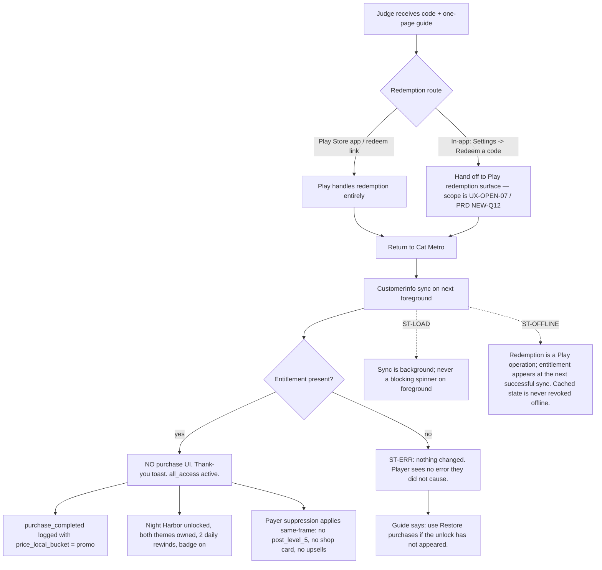

**Layout intent.** No dedicated screen. One row in Settings > Purchases (`Redeem a code`) and, on success, one toast. The judge-facing surface is the one-page guide shipped with the codes, not in-app UI.

**Component inventory.** Settings row `Redeem a code` · handoff to Play · thank-you toast · (no code input field in-app unless `UX-OPEN-07` says otherwise).

**Copy draft.** **[DRAFT]** row: "Redeem a code". **[DRAFT]** success toast: "Thanks — All Access is on. Everything's unlocked." (must not render a price and must not read as a purchase receipt).

**Interaction behavior.** Redemption produces **no purchase UI** — the entitlement simply arrives via CustomerInfo sync, and the only feedback is the toast plus the content becoming available. The `price_local_bucket=promo` analytics value keeps promo grants out of revenue reporting.

**Platform-convention notes.** Promo codes are redeemed through Google Play; an app-side "redeem" row should hand off rather than collect the code itself (collecting it in-app and calling a redemption API is *not* how Play promo codes work) [PC-6]. The exact scope of "the app integrates Play In-app Promotions" (`EXECUTION_PLAN.md:152-154`) is a client-capability question the PRD already flags as NEW-Q12 — I do not resolve it.

**States.**

| State | Behavior |
|---|---|
| `ST-EMPTY` | N/A — the row is always present. |
| `ST-LOAD` | CustomerInfo sync is background; never blocks foreground. |
| `ST-ERR` | If redemption fails on Play's side, the app shows nothing (it never saw an attempt). The guide, not the app, carries the troubleshooting step. If sync fails, cached state is retained; no error toast. |
| `ST-OFFLINE` | Entitlement appears at the next successful sync; offline never revokes a cached entitlement. |
| `ST-PENDING` | If Play reports pending, the standard pending chip applies in Shop. |
| `ST-RESTORE` | The documented recovery path for "code redeemed but nothing unlocked" is `Restore purchases`; it must be named in the judge guide. |
| `ST-NOFILL` | N/A. |
| `ST-PERMDENY` | N/A. |

**Accessibility acceptance criteria (testable).**

- `A11Y-S12-1` `Redeem a code` row announces role and destination (`"Redeem a code, opens Google Play, button"`).
- `A11Y-S12-2` The success toast is announced assertively and its text does not contain a price or the word "purchase".
- `A11Y-S12-3` A clean-device end-to-end redemption produces zero purchase dialogs; automated/manual test evidence recorded (D17/D24 acceptance criterion).
- `A11Y-S12-4` After redemption, every previously-locked surface announces its new state correctly (Night Harbor tile no longer announces "All Access"; theme swatches announce "owned").

---

## 3. GLOBAL ACCESSIBILITY ACCEPTANCE CRITERIA (feed test-author directly)

These apply across all flows; per-flow criteria above are additive.

- `A11Y-GLOBAL-1` **Tap targets.** Every interactive element in every screen ≥48×48dp on the 360×640dp reference and on the tablet tier, verified by an automated UI enumeration that fails the build on any violation [PC-1]. Pre-launch report shows zero unresolved tap-target findings before production submit.
- `A11Y-GLOBAL-2` **No color-only information.** Every state, line identity, and alert carries a second channel (symbol, silhouette, shape, position, or text). Greyscale playthrough of L001, L018, one Daily, the shop, the rewind sheet, and the paywall finds zero ambiguities. Reviewer-signed checklist (WCAG 2.2 SC 1.4.1) [PC-7].
- `A11Y-GLOBAL-3` **Contrast.** Body text ≥4.5:1; meaningful non-text UI and state indicators ≥3:1, on **both** Day and Night presets and **every** theme (SC 1.4.3, 1.4.11) [PC-7]. Automated palette check in CI. Known failures today: Tabby Yellow 1.42:1 and Garden Green 2.59:1 on Cream Card — TG-1 chooses the fix.
- `A11Y-GLOBAL-4` **Colorblind gate.** Deutan/protan/tritan simulation pass is a merge gate for any palette or theme change; all five lines distinguishable by symbol + silhouette alone with color removed.
- `A11Y-GLOBAL-5` **Silhouette legibility.** Every cat silhouette is distinguishable at 64 px; assets failing are re-topo'd or cut.
- `A11Y-GLOBAL-6` **Motion.** A single motion toggle (plus OS animation-scale respect) removes all non-informational motion app-wide, persists, and loses no information [PC-14].
- `A11Y-GLOBAL-7` **Haptics.** A single master toggle; off means zero haptic calls; every haptic is redundant with a visual.
- `A11Y-GLOBAL-8` **Mute-first.** A full scripted playthrough at volume 0 exposes every P0 signal visually (chain state, overload, fail cause, win rollup). Reviewer-signed checklist.
- `A11Y-GLOBAL-9` **Timing.** No decision in any shipped level requires a window <6 ticks (750 ms); onboarding uses 12–16. Planning pause exists as the timing-relief mechanism and is offered inline after 3 fails on a level (SC 2.2.1 spirit) [PC-7].
- `A11Y-GLOBAL-10` **Font scale.** All chrome, sheets, paywalls and settings survive 130% system font scale with no truncation of any legally- or fairness-load-bearing string (prices, disclosures, "you were not charged", the rewind footer line).
- `A11Y-GLOBAL-11` **Focus & escape.** Every modal/sheet: focus lands on a sensible first element, order matches visual order, no focus trap, and the Android back gesture always escapes (except mid-purchase, where it is deliberately swallowed and announced) [PC-3][PC-8].
- `A11Y-GLOBAL-12` **Screen-reader coverage boundary.** Menus, HUD chrome, sheets, results, shop, settings are labelled in the Unity accessibility hierarchy [PC-12]; the live board is out of scope at 1.0 and this boundary is stated honestly wherever accessibility is claimed (`UX-OPEN-11`).
- `A11Y-GLOBAL-13` **One-thumb reachability.** Every primary action in every flow is inside the bottom 25% of the safe area; an automated layout test enumerates primary CTAs and fails on any above that line.
- `A11Y-GLOBAL-14` **No dark patterns, structurally.** Contract test over every commerce surface's rendered tree: zero countdown timers, zero preselected options, close affordance present at full opacity from frame 1 at ≥48dp, decline copy from the approved neutral list.

---

## 4. XR MODE

**Not applicable.** Cat Metro is portrait Android with a locked orthographic camera; there is no XR target in scope, and 3D camera orbit/zoom is an explicit pre-refused anti-feature (`product_spec.md:783-794`). No comfort defaults (locomotion, vignette, snap turn), reach/height envelopes, or verify-in-headset checklists are produced. The nearest analogue that *does* apply here — a physical-device verification pass a human must feel rather than read — is the **fat-finger gate** (5 testers, 720p device, mis-tap <3%) and the **mute + greyscale + motion-off reviewer checklists** named above. Those are the human-in-the-loop checks for this product.

---

## 5. OPEN — flows the PRD implies but under-specifies

Not invented, not resolved. Each needs a human answer before an implementer can build it. PRD cross-references given where one exists.

| ID | Gap | Why it blocks | Related |
|---|---|---|---|
| `UX-OPEN-01` | **Planning-pause gesture surface and default state.** Hold-anywhere vs hold-on-switch; always-on vs opt-in; interaction with the 500 ms Android long-press default and TalkBack explore-by-touch. | Core verb integrity. | TG-2; `product_spec.md:191,486` |
| `UX-OPEN-02` | **Pause menu contents.** Back gesture "opens the pause menu" is specified; its items are not. Does it contain Restart? Settings? Restore? Does pausing count against anything? | Every Game-scene flow terminates here. | `architecture.md:82` |
| `UX-OPEN-03` | **Results screen layout order and what may occupy the footer.** One primary CTA is locked; the footer inventory (share, `double_tickets`, theme chip, next-district tease) is not. | S-03, S-09, S-12 all write to this screen. | TG-4; `product_spec.md:382` |
| `UX-OPEN-04` | **Do we tell the player when the Daily fell back to the backup pool?** Silence preserves "everyone plays one board"; disclosure preserves honesty. | Daily tile copy. | `product_spec.md:459` |
| `UX-OPEN-05` | **Theme rental: where is the remaining-level count displayed, and does a completed pending purchase auto-equip?** Neither is specified. | S-08 component inventory. | `monetization_spec.md:145-163` |
| `UX-OPEN-06` | **What does the shop's "Manage" link do** when we sell no subscriptions? Order history? Customer Center? Support mail? | Wording risks implying a subscription. | `monetization_spec.md:251`; PRD NEW-Q32 |
| `UX-OPEN-07` | **In-app promo redemption scope:** row-that-hands-off-to-Play vs an in-app code field. Play promo codes are redeemed by Play [PC-6]; "the app integrates In-app Promotions" is not a UX spec. | S-12 build scope. | PRD NEW-Q12; `EXECUTION_PLAN.md:152-154` |
| `UX-OPEN-08` | **Confirm the two-code-types split** (Play promo code vs challenge/route code) and where the route-code field lives on Home. | Support-load and IA risk. | `product_spec.md:706` |
| `UX-OPEN-09` | **Audio controls in Settings** (music/SFX/master) — none are specified, only haptics + motion. | Settings inventory. | TG-6; `EXECUTION_PLAN.md:186` |
| `UX-OPEN-10` | **First-run consent screen content** ("one screen, nothing pre-checked" names no content). | S-01 step 2. | TG-7; `product_spec.md:297` |
| `UX-OPEN-11` | **Screen-reader scope boundary** (chrome yes, live board no) and the honest wording used wherever accessibility is claimed, including the store listing. | A11Y-GLOBAL-12 and listing copy. | §1.3 |
| `UX-OPEN-12` | **Night Harbor on the Home map:** labelled tile from first view vs depot silhouette in session 1. | S-05/S-06 first-session read. | TG-3; PRD NEW-Q30 |
| `UX-OPEN-13` | **Failure copy voice** — terse locked strings vs the chatty blame-chip exemplar. | Every fail render. | TG-5 |
| `UX-OPEN-14` | **Comeback grant values and the streak-repair window/floor** are unresolved in the corpus; the welcome-back board cannot be laid out until the grants are known. | S-10 card content. | PRD NEW-Q24, NEW-Q25, U-8 |
| `UX-OPEN-15` | **Daily share deep-link form** `catmetro://daily?d=…&b=…` is not in the registered route list, so the share-card link target is undefined. | S-09 share card. | PRD NEW-Q15 |
| `UX-OPEN-16` | **`payer_thanks` surface** (IAM at first session start vs scheduled send) determines whether a payer sees an in-app surface at all. | Post-purchase moment. | PRD NEW-Q10, U-3 |
| `UX-OPEN-17` | **Low-tier 30 Hz cap: automatic or a user-visible setting?** If user-visible it belongs in Settings and needs copy. | S-11 inventory. | PRD NEW-Q28 |
| `UX-OPEN-18` | **The blame chip has no shipped precedent I can name** (killcam is the nearest, but it does not assign a named cause in text). Flagged **EXPERIMENTAL**; the 20/20 scripted-scenario gate is the de-risking mechanism, but a human should confirm we accept the novelty. | S-03. | `product_spec.md:258-265` |
| `UX-OPEN-19` | **Theme rental (3 levels via rewarded ad) — precedent thin.** Flagged **EXPERIMENTAL** per my rules. | S-08. | TG-8 |

---

## 6. TRACEABILITY — PRD story → UX artifact

| PRD requirement | Flow | A11y criteria |
|---|---|---|
| CM-R13, CM-R06.4, CM-R40.1, CM-R52.1 | S-01 | A11Y-S01-1…7 |
| CM-R07, CM-R17, CM-R18, CM-R21, CM-R22, CM-R01/02 | S-02 | A11Y-S02-1…10 |
| CM-R03, CM-R15, CM-R16, CM-R19.3 | S-03 | A11Y-S03-1…10 |
| CM-R08, CM-R35, CM-R36, CM-R27, CM-R29 | S-04 | A11Y-S04-1…8 |
| CM-R09.4, CM-R10.4, CM-R11.3 | S-05 | A11Y-S05-1…8 |
| CM-R26, CM-R10, CM-R25, CM-R29, CM-R30 | S-06 | A11Y-S06-1…9 |
| CM-R23, CM-R25, CM-R27, CM-R28, CM-R32 | S-07 | A11Y-S07-1…9 |
| CM-R25, CM-R35.5, CM-R24.4, CM-R21.4 | S-08 | A11Y-S08-1…8 |
| CM-R11, CM-R46, CM-R54, CM-R35.4 | S-09 | A11Y-S09-1…7 |
| CM-R49, CM-R35, CM-R42, CM-R11.5 | S-10 | A11Y-S10-1…6 |
| CM-R22.3, CM-R40, CM-R53, CM-R28.1, CM-R50.6 | S-11 | A11Y-S11-1…9 |
| CM-R31, CM-R23, CM-R54.4 | S-12 | A11Y-S12-1…4 |
| CM-R20, CM-R21, CM-R22 (cross-cutting) | all | A11Y-GLOBAL-1…14 |

**Not covered here (deliberately, out of the requested scope):** District Cup surfaces (CM-R47 — `SHOULD`, first live ~Aug 31, and two of its rules are unresolved in the PRD), share-card composition detail beyond its entry points (CM-R54), and the capture rig (CM-R55, dev-only).

---

## 7. PLATFORM CONVENTION SOURCES

Cited inline as `[PC-n]`.

- **PC-1** Material Design 3 — Accessibility basics (48×48dp minimum touch target) — https://m3.material.io/foundations/accessible-design/accessibility-basics ; Android `ViewConfiguration` long-press default (500 ms) — https://developer.android.com/reference/android/view/ViewConfiguration#getLongPressTimeout()
- **PC-2** Material Design 3 — Bottom sheets guidelines — https://m3.material.io/components/bottom-sheets/guidelines
- **PC-3** Android — Predictive back gesture / custom back handling — https://developer.android.com/guide/navigation/custom-back/predictive-back-gesture
- **PC-4** Android — Notification runtime permission (Android 13+) — https://developer.android.com/develop/ui/views/notifications/notification-permission
- **PC-5** Google Play — In-app review: when to request — https://developer.android.com/guide/playcore/in-app-review#when-to-request
- **PC-6** Google Play Console Help — Promo codes / in-app promotions — https://support.google.com/googleplay/android-developer/answer/6321495
- **PC-7** W3C — WCAG 2.2 (SC 1.4.1 Use of Color, 1.4.3 Contrast Minimum, 1.4.11 Non-text Contrast, 2.2.1 Timing Adjustable, 2.2.2 Pause Stop Hide) — https://www.w3.org/TR/WCAG22/
- **PC-8** Android — Accessibility principles (labels, focus order, live regions) — https://developer.android.com/guide/topics/ui/accessibility/principles
- **PC-9** Material Design 3 — Snackbar guidelines — https://m3.material.io/components/snackbar/guidelines
- **PC-12** Unity — Accessibility module / accessibility hierarchy (screen-reader support on Android) — https://docs.unity3d.com/Packages/com.unity.modules.accessibility@1.0/manual/index.html
- **PC-13** Google Play Billing — Pending transactions — https://developer.android.com/google/play/billing/integrate#pending
- **PC-14** Android — Reduce/remove animations & `Settings.Global.ANIMATOR_DURATION_SCALE` — https://developer.android.com/develop/ui/views/animations/reduce-motion

**Shipped-precedent register** (named per my rules; anything I could not name is flagged EXPERIMENTAL above): Mini Metro — overcrowding countdown ring, camera-on-failure, pause-while-editing, shape/symbol colorblind coding. Wordle / NYT Games — one identical daily board worldwide + spoiler-free share card. Duolingo — streak with repair token. Celeste — assist offered inline after repeated failure; sub-second retry (with Super Meat Boy). Forza Horizon — rewind to a prior safe point. Candy Crush / Monument Valley — map level-select with per-node star readouts. Call of Duty killcam — post-failure replay of the causal moment (nearest precedent for the cause camera; the *blame chip text* is the novel part, `UX-OPEN-18`).

---

## 8. DEFINITION OF DONE FOR THIS DOCUMENT

- [x] Every in-scope story has a Mermaid flow including empty / loading / error / offline / purchase-pending / restore / no-fill / permission-denied states.
- [x] Every screen has a spec precise enough to build from: layout intent, component inventory, copy (locked vs draft marked), interaction behavior, platform-convention notes with citations.
- [x] Every flow has accessibility acceptance criteria written as testable checks, ID'd for test-author pickup.
- [x] Taste-gate questions for the human are at the top (§0).
- [x] No interaction pattern proposed without a named shipped precedent, or flagged EXPERIMENTAL (§5 `UX-OPEN-18`, `UX-OPEN-19`).
- [x] Under-specified flows filed as OPEN (§5), not invented.
- [x] XR mode explicitly N/A with reasoning (§4).
- [x] No source code touched.
- [ ] **Awaiting:** human taste gate on TG-1…TG-8, answers to `UX-OPEN-01…19`, and product-analyst traceability review against the PRD.
